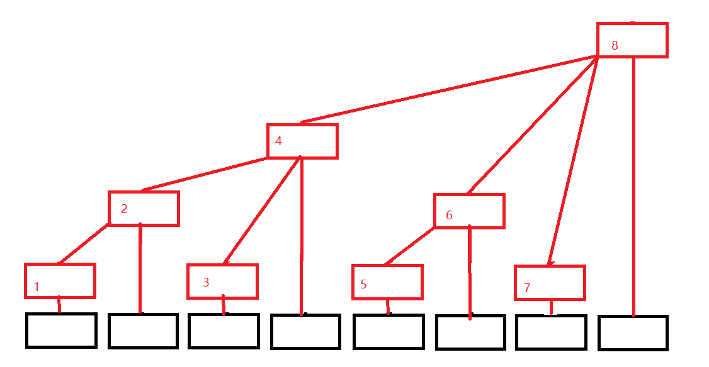

# 树状数组

和树状数组有关的数据结构是线段树，它们都能够完成**区间查询**和**单点修改**两个问题，但是理论上线段树的功能更加强大，而树状数组一般就是用来做上面的两个问题的。而区间查询一般是解决**区间求和**问题。

## 最低位的求解

先看一个子问题，如何求解一个数的最低二进制位为 1 的位。

最普遍的做法是从后往前看，碰到某一位为 1 了就返回，时间复杂度为 O(n)。但是其实有一个小技巧可以记录一下，只需要 O(1) 的复杂度就可以求解该问题：

```c
int lowbit(int x) {
	return x & (-x);
}
```

举一个例子：假设现在 x = 6，二进制表示为 00000110，那么应该是第二位是答案，现在可求得 -x = 11111010，所以按位与后得到 00000010 正好代表了最低位是 1 的位数。

---

那么最低位求解和树状数组有什么关系呢，树状数组最根本的形态引用网上的一张图：



其中存储的形态如下，假设数组中有 A[1] ~ A[8] 对应最底层的 8 个黑色方格。那么树状数组中，也就是上面的红色方格中存放的就是数组的局部和形式，比如：

```
C[1] = A[1]
C[2] = A[1] + A[2]
C[3] = A[3]
C[4] = A[1] + A[2] + A[3] + A[4]
```

依次类推，那么假设我们已经得到了这样的一个树状数组了，想要修改某个单元的元素，就需要从底层向上层进行修改，将用到某个元素的节点的值都修改了。比如此时修改 A[1] 的值，那么 A[2]、A[4] 、A[8] 都需要修改。那假设 A[1] 需要增加或者减少一个值 a, 意味着 A[2]、A[4]、A[8] 也需要相应增加或者减小。再看是怎么确定的：

```
A[1] = A[00000001]
A[2] = A[00000010] = A[00000001 + lowbit(1)]
A[4] = A[00000100] = A[00000010 + lowbit(2)]
A[8] = A[00001000] = A[00000100 + lowbit(4)]
```

这个时候看到规律了，在更新时如何确定上面的元素需要修改，可以使用到 lowbit，修改的复杂度是 logn，因此单点修改的代码如下：

```c
void update(int cnt, int addValue) {
	while(cnt <= n) {
		A[cnt] += addValue;
		cnt += lowbit(cnt);
	}
}
```

然后是区间的查询，对于树状数组而言，由于已经是局部和的情形了，所以它最擅长的就是求区间和，比如现在我们想查询 A[1] ~ A[6] 的和。

```
C[4] = A[1] + A[2] + A[3] + A[4] 
C[6] = A[5] + A[6]
sum = C[4] + C[6]

C[6] = C[00000110]
C[4] = C[00000100] = C[00000110 - lowbit(6)]
```

现在又看到了 lowbit 的作用了，在计算区间和的时候，每一步对求的和的区间进行拆解，然后将各个子区间的和累加就得到了总的区间和。这个计算也是 logn 的复杂度，代码如下：

```c
int query(int cnt) {
	int sum = 0;
	while(cnt > 0) {
		sum += C[cnt];
		cnt -= lowbit(cnt);
	}
	return sum;
}
```

那么最后剩下了树状数组的初始化方法，树状数组的初始化是依次遍历每一个源数据的基础上进行 update：

```c
for(int i = 0; i < n; i++) {
	update(i, C[i]);
}
```

