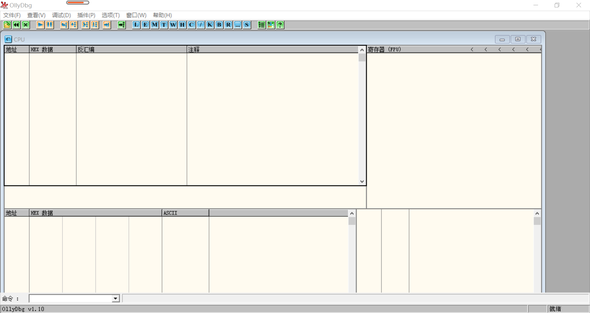
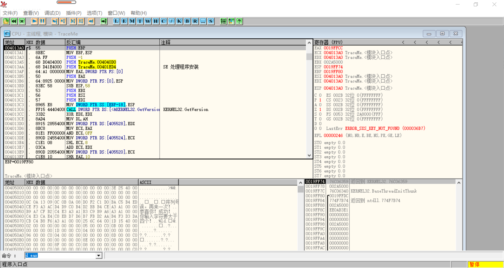
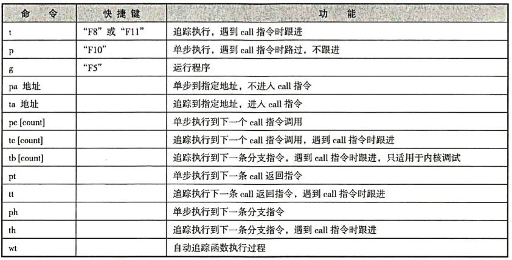

# 动态分析技术

像x64dbg，mdebug都是用来进行动态分析的工具，所谓动态分析对运行时的程序进行分析，通过程序的执行，能够对程序执行的流程有一个更好的把握。

其实之前对逆向的了解中，我已经知道了一款比较有名的工具 OllyDbg。那么在这里就拿这个工具对网上的一个测试用例 TraceMe.exe 软件进行一次动态分析。

> 在正式了解如何使用 OllyDbg 来进行动态分析之前，先知道一下 TraceMe 是干嘛的。TraceMe 就是一个简单的验证用户名和序列号的一个小程序，就是只是一个验证算法，现在的目的就是为了通过这个验证。

##  OllyDbg

我是用的 OllyDbg 是老版 1.10 的，是从网上好不容易淘到的。

> 使用的时候必须右击选择“以管理员身份运行此程序”，这样可以让工具的部分功能能够运行。

有必要看一下主界面方便记录：

最基本的界面如上其中分为：

* 反汇编窗口：左上方区域，显示的是反汇编后的程序，其中有四列分别是地址、机器码、反汇编代码和注释。
* 数据窗口：以十六进制和字符方式显示内存中的数据。
* 寄存器窗口：右上方区域，显示的是CPU各个寄存器中的值。
* 栈窗口：右下方区域，显示的是栈内的数据，就是 ESP 寄存器指向地址的内容。这里重要的一点是可以监视函数的传递参数和变量。

> 讲在前面，当我们进行分析的过程中，可能需要保存一些数据以便下次分析，那么 UDD 格式的文件就是它的工程文件，里面保存了调试过程中的一些状态。
>
> 这个软件也支持加载外部的 DLL，以方便使用函数名来显示相关函数。

### 具体操作

我们首先打开目标程序，这个过程就不用多说了吧。那么一般打开了目标软件之后，就自动停在了第一条指令处。

我们的目标是需要绕过目标程序的验证过程。对于一个调试器最重要的就是单步调试了。

* F7：进行单步，可进入函数体；
* F8：进行单步，不进入函数体；
* Ctrl+F9：运行到 ret 指令中断；
* Alt+F9：回到应用程序中；
* F9：运行程序。

其次为了对程序的执行进行监视，需要对关键点设置断点，其实双击反汇编面板的某一行的 Hex 数据或者按 F2 都可以在某一行设置断点。再次操作可以取消断点。使用了 Alt+B 可以查看当前的所有断点状态。

针对设置断点，通常有如下几种断点的选择，以方便后续的代码调试：

1. INT 3断点：就是最普通最常用的断点，这时候你会注意到当设置了 INT 3 断点后，指令代码会被替换成 CC(0xCC)。这相当于会导致一个异常。但是这个断点的副作用就是修改了指令，这样容易被检测出来。
2. 硬件断点：右击选择 Breakpoint --- Hardware on execution。这是使用了 Intel 自身的 DRx 调试寄存器，中断的地址会存放在 DR0 ~ DR3 寄存器中。这个断点不会被检测但是只能设置4个，受限于寄存器的数量。删除硬件断点需要需要在特定页面关闭。
3. 内存断点：这个断点时针对内存的访问，包括读与写，原理就是对所设的地址赋予不可读或者不可写的属性，这样使得在进入内存的时候会产生异常。所以它可以对数据窗口或者代码的某个地址处右击设置断点。
4. 一次性断点：工具上使用 ALt+M 显示内存的情况，可以看到分段情况，可以在某一项上使用 F2 设置一个断点，这个断点是一次性的。
5. 消息断点：这是针对 Windows 消息驱动的特性。点击 视图--- 窗口，可以列出窗口的相关参数，这样你可以针对窗口上的控件针对这个控件发生的事件下断点。但是这样下断点很难回到主代码空间，所以要依靠内存一次性断点来帮助返回。
6. 条件断点：在调试的过程中可能根据某个触发条件，比如根据寄存器的条件，根据存储器的条件，这个需要在某个断点中按下 Shift+F2 快捷键然后设置某个条件。

> 这个工具还支持使用 Run Trace 来将调试的程序执行过的指令保存下来，这会将地址和寄存器的内容等记录到缓冲区中，或者可以保存到文件中。当然还能使用这个功能来记录可识别函数的调用次数。
>
> 另外 Hit Trace 功能可以辨别哪一个部分代码被执行，哪一部分没有。其实原理就是在每一条命令处设置一个 INT 3 断点，来检测命令有没有被执行到。

### 实际的例子

这里以破解 TraceMe 来看这个工具到底如何使用。我们经过分析知道，我们需要执行 TraceMe 的话需要在文本框中输入信息，而对于程序来说需要获取文本框中的值。

>GetDlgItemText，windows中获取文本框中信息的句柄函数。

通过分析，就需要查找代码中的该函数执行的位置。在 OllyDbg 中使用 Ctrl+G 来查找对应程序的位置，方便设置断点。

比如我们现在在 GetDlgItemText 处设置一个断点，那么自然当我们 F9 运行时，就会执行到该断点处停止。

当然我们对于这些句柄函数要足够了解，知道它们的参数，你可以在函数调用时看到堆栈中参数的变化。也可以通过在数据区指定查看比如 eax 指向的地址的内容，来看到底返回值是多少。

最后当我们通过分析确定了代码执行流程之后，我们发现在关键的分支上，只需要跳过跳转到出错的分支就可以避免判断失败的发生，所以在代码区双击就可以修改对应的代码(比如使用 nop 指令填充)。

当然如果想要保存最终修改后的代码，就在修改后的代码中右击选择“复制到可执行 --- 选择”，然后再选择保存文件，就可以了。**这种屏蔽程序某些功能或者改变程序流程使程序的保护方式失效的方法称为“爆破”。**

> 具体在使用中还碰到了什么比较重要的之后再来补充吧。

## WinDbg

WinDbg 本身是 Windows 平台上得一款强大的内核态和内核态调试工具，是微软公司提供的免费调试器，它可以用来调试应用程序、内核调试、分析崩溃转储文件等工作。

WinDbg 一共分为 x86 和 x64 两个版本，那么在使用的时候要注意操作系统的版本和使用的应用程序的版本。

作为 WinDbg，它使用工作空间描述调试项目的属性、参数等信息。通过上面的 View 选项可以打开其他的子窗口。

关于调试符号的引入，包括例如内部函数名、变量名、结构体定义等等，都对调试提供了重要的内部信息。WinDbg 允许用户指定目录来存放符号文件，并使用 _NT_SYMBOL_PATH 来指向这些目录位置。在调试的可以使用命令 ld 从附后文件目录中加载符号。WinDbg 中对付好的表示方式为”模块名！符号名“。

### 使用过程

> WinDbg 允许多种调试模式

如果你使用 Ctrl+E 打开一个应用程序，你会发现它并不会停在程序入口处，而是会停在 ntdll.dll 中的系统断点处。需要你在命令行中输入 “:g @$exentry” 转到程序入口。

在 WinDbg 中进行单步跟踪，除了普通的一些命令，还需要如下：

#### 设置断点

WinDbg 也支持多种断点，当然你可以选择使用命令来设置，命令的话这里也不赘述了：

* 软件断点，也就是 INT 3 断点。
* 硬件断点
* 条件断点

#### 栈命令

使用 k 系列的命令可以查看栈回溯。使用 k 命令产生清单中每一行都是描述了当前的线程的一个栈帧。横向分别是栈帧的基地址、函数的返回地址和函数名及执行位置。

#### 内存命令

* d 命令可以用来显示指定地址的内存数据
* s 命令可以用来指定内存范围中搜索字符串
* e 命令用来修改内存中的数据
* !address 命令用来查看内存的属性

