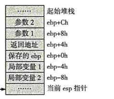

# 逆向分析技术

在之前的静态分析和动态分析的介绍中，只是介绍了在软件动态分析和静态分析中可能运用到的一些工具和技术使用，在这一节中将根据32位和64位软件的特征，具体分析每一种软件的方法。

> 将可执行程序反汇编，通过分析反汇编代码来理解其代码功能，然后用高级语言重新描述这段代码，逆向分析原始软件的思路，称为逆向工程。

一般所谓的软件破解只是逆向工程中非常初级的部分。

## 32位软件的逆向技术

在编写 win32 的应用程序，源代码中都会有 WinMain 函数，但是这并不是程序执行最开始的地方，首先执行的叫**启动函数**，是由编译器生成的。

> 启动函数的目的是初始化进程。在 c/c++ 中启动函数的作用无非就是检索新进程命令行指针，环境变量指针，全局变量初始化和内存栈初始化。

完成启动函数后程序会进入所谓进入点函数(main 和 winMain)。当执行完主函数后，就会执行 exit 函数，进行一些处理，然后退出进程。

### 函数

一般而言研究软件还是从主函数开始的。逆向分析，把重点放在函数的识别和参数的传递上。

绝大多数情况下，编译器都使用 call 和 ret 指令来调用函数和返回调用位置。可以通过定位 call 和 ret 指令来识别函数，call 指令的操作数就是所调用的函数的首地址。

函数传参的方式分别有：栈方式、寄存器方式和通过全局变量进行隐含参数传递。

* 栈方式：栈顶指针 esp 指向栈中第一个可用的数据项。调用函数时需要将参数按照给定的顺序压入栈。调用结束后修改栈指针，这个是**平衡栈的做法**。一般来说非优化的编译器用一个专门的寄存器(ebp)对参数进行寻址。

  

  那么在很多情况下都会使用编译器按照优化方式编译程序，所以栈寻址方式会不同。比如会使用 esp 对参数进行寻址，所以这需要定位每一次esp的值。

* 寄存器方式：这是由编译器开发人员制定的，比如 FastCall，它是靠寄存器传递参数的。
* 名称修饰：为了实现操作符和函数重载，C++ 编译器会按照某种规则修改每一个入口点的符号名，这种技术就是名称修饰。每一种名称修饰都有特定的方法。

函数的返回通常使用 return 操作符，还有通过参数按传引用方式返回值、通过全局变量返回值等。

* 用 return 操作符返回值时，函数的返回值放在 eax 寄存器当中。

### 数据结构

在进行逆向分析时，确定数据结构以后，算法就很容易得到了。

* 局部变量：这是函数内部定义的一个变量，通常局部变量分配空间时通常会使用栈和寄存器。比如我们会看到类似 `sub esp，8` 开辟某一段栈空间。

* 全局变量：它被存放于全局变量内存区，通常位于数据区块(.data)的一个固定地址处，所以如果要访问，会对一个固定的硬编码地址寻址。(如果放到只读区块里，就是一个常量)

* 数组：数组会在内存中连续存放在一起。通常情况下它是以基址加变址的方式实现的。

### 虚函数

像 C++ 这一门支持面向对象的语言，可以说它最终要的概念是虚函数，虚函数的地址本身并不能在编译时确定，只能在被调用的时候确定。所有虚函数会放在一个**虚函数**表中，数组中存放的时虚函数的地址。

###  控制语句

这个和绝大部分的跳转指令有关，而识别关键的跳转指令是软件解密的一项重要技能，有许多软件用一个或多个跳转实现了注册或者非注册功能。

* 一般使用 cmp 指令来标识 IF 语句，两个操作数相减的结果会影响许多标志位，而后面的跳转就是根据标志位来确定的。一般还会使用 test 或者 or 指令来替换 cmp 指令。
* 汇编器会将 SWITCH 语句编译成一组由不同的关系运算组成的语句。

可以参考一下汇编中可能出现的跳转，包括短转移、长转移和子程序调用。

* 无条件短转移的机器形式是 EBxx。其中 EB00 --- EB7F 是向后转移，剩下向前转移。
* 无条件长转移机器码是 E9。
* 条件设置指令：SETcc r/m8。

### 循环语句

循环是高级语言中可以进行反向引用的一种语言形式，一般可以通过这一点来识别循环语句。

如果是循环代码，可以尝试分析计数器，一般都是用 ecx 来存放计数器，也有其他的方法，比如 `test eax，eax` 。

### 数学运算语句

这个关于加法、减法、乘法和除法，相关的指令大家其实都很熟悉。但是有很多的编译优化后都喜欢使用 lea 指令来替代相关的指令。

### 字符串的存储

* C 字符串终止符为 ‘\0’。
* DOS 字符串终止符为 ‘$’。
* PASCAL 字符串没有终止符。

## 64位软件逆向技术

上面的例子针对的大多是 VC6.0 编译出来的程序，那么下面针对的 64 位的程序的逆向分析大多是 VS20xx 系列编写出来的程序。

64 位的程序再使用寄存器方面和 32 位的程序就有些差别了，它的寄存器扩展到了64位，寄存器的表示中第一个字母从 E 变为了 R。同时在数量上，在原来的基础上扩充了8个寄存器(R8 ~ R15)。

### 函数

RSP 指针指向栈顶，栈中存放的东西和 32 位存放的东西一致。重复的就不多说了，唯一有点不同的是，在 64 位的环境中可能会出现申请了栈空间但不使用的情况，这是为了实现对齐。

#### 启动函数

同样在这里也有启动函数这一说法，概念和 32 位程序一样。同样在逆向的过程中要想办法定位到入口函数处。

#### 调用约定

在 64 位的程序调用约定中，只有一种寄存器快速调用约定，就是前四个参数使用寄存器来传递，如果超过 4 个，多余的参数会放入栈中。并且前四个参数所使用的寄存器是固定的，第一个是 RCX，第二个是 RDX，第三个是 R8，第四个是 R9。任何大于8字节或者不是1，2，4，8字节的数据需要使用由引用来传递，浮点数的传递由 XMM 寄存器完成。

**但是要注意的是，虽然前四个参数是由寄存器传递的，但是栈中还是会为它们预留空间。**

> 比如在将结构体作为参数传递给函数时，当传参的内容小于8字节，就将整个结构体塞到寄存器中，否则需要先复制到栈中。

#### 函数返回

64 位的环境下，程序使用 RAX 寄存器来保存函数返回值。浮点类型使用 MMX0 寄存器返回，返回值大于8字节可以将栈空间的地址作为参数间接访问。

### 数据结构

在逆向分析中，主要还是需要对局部变量、全局变量和数组结构进行识别。

* 对于局部变量来说，还是存放在栈内。
* 全局变量的地址在编译器开始就是固定的，所以在程序里是用固定地址去访问的。
* 数组也是以线性方式来存储在内存中。访问数组的元素就是定位数组的首元素，然后计算数组元素的下标，多维数组也是一样。

### 控制语句

* 对于 if ... elseif ... else 类语句，识别的方法还是查看代码中的 j 开头的跳转命令，然后推理出代码的流程。
* switch 分支同样也是 if else 语句的变形，但是编译器可能会对此进行变形，比如**当分支数小于6个时，则直接使用if else的方式，否则就会使用其他手段优化。比如使用 case 表；如果 case 项还要多，那么就使用判定树。**

### 循环语句

主要针对三种循环语句的语法：do，while，for

* do ... while：限制性语句块，再进行表达式判断，所以识别的时候会发现其实标签下方有一个向上跳转到其实标签的跳转语句。
* while：先判断再执行，中间应该有两个跳转，一个是判断是否满足条件，一个是向上跳转。
* for：也是先判断再执行，但是会比 while 还要多一个跳转，因为在第一次执行的时候要跳过处理累加的操作。

### 数学运算

此处略，其中会有多种优化方法，具体遇到的时候再说明。

### 虚函数

同样用一个虚表来标识类中的虚函数，具体一个类中只要有至少一个虚函数就建立一个虚表，并且不同类的虚表是不同的。

在这里面主要针对 C++ 中的程序，要能清晰的辨认出程序中的构造函数及析构函数的位置。

> 那么这里面比较复杂，等看完了代码再回来补充了。

一共分为五类：

* 普通类虚表
* 单重继承虚表
* 多重继承虚表
* 菱形继承虚表
* 抽象类虚表

