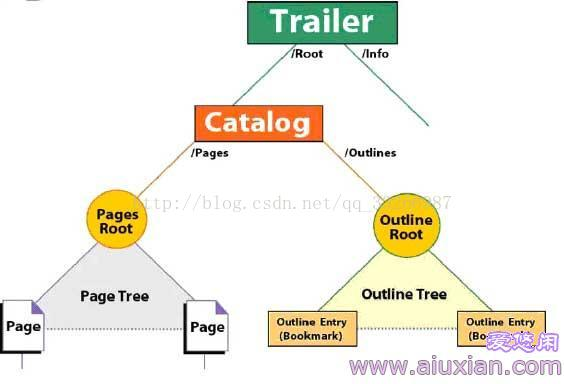
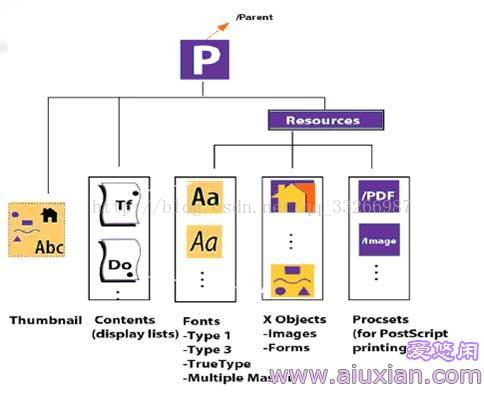

# PDF格式详解

pdf是一种可移植的文档格式，可以呈现文本，呈现图像，多媒体元素等，它可以用来包含图像，多媒体元素甚至执行javascript脚本。它的基本结构包含了一个header头部，一个body主题，一个xref表和一个trailer。

* header:这是pdf的第一行，用来表示pdf的版本号。一般很明显有一个%PDF-...%
* body:主体，存储了所有要显示给用户看到的数据。
* xref表：交叉引用表，这是包含了所有对文档中的对象的引用。这说明一个pdf不一定要通过遍历整个文档从而获取每一个对象，对象的引用都存在于这个表中。每个对象就是其中的一个条目，一个条目有20个字节。

> xref
> 122 42
> 0000000016 00000 n
> 0000001730 00000 n
> 0000002049 00000 n
> 0000002204 00000 n

就以这个为例子，这是表中的单独一个部分，其中有一行有两个数字，第一个为对象编号，第二个为对象个数，之后的就是对象条目，其中条目中的第一个部分为对象偏移，第二个部分是对象的时代号，第三个部分为当前是否正在使用。

> startxref
> 0
> %%EOF

PDF文档的最后一行包含文件字符串'%% EOF'的结尾。在文件标记结束之前，有一行带有字符串**startxref**，用于指定从文件开头到交叉引用表的偏移量。

* trailer: 在这一部分会定义一些键值

> <</Size 164/Prev 274739/Root 123 0 R/Info 121 0 R/ID[<4EE20B0A332272E45E0B631B4AA4BBA9><5AC436FA7E382844A1C4A83DA68BD01B>]>>

/ Size [integer]：指定交叉引用表中的条目数（也计算更新部分中的对象）。使用的数字不应是间接参考。

/ Prev [integer]：指定从文件开头到上一个交叉引用部分的偏移量，如果有多个交叉引用部分，则使用该偏移量。该数字应该是交叉引用。

 / Root [字典]：指定文档目录对象的引用对象，它是一个特殊对象，包含指向不同类型的其他特殊对象的各种指针（稍后将详细介绍）。

/ Encrypt [dictionary]：指定文档的加密字典。

/ Info [字典]：指定文档信息字典的引用对象。

/ ID [array]：指定形成文件标识符的两个字节未加密字符串的数组。

/ XrefStm [integer]：指定从解码流中的文件开头到交叉引用流的偏移量。这仅存在于混合引用文件中，如果我们还想要打开文档，即使应用程序不支持压缩引用流，也会指定它。

pdf支持增量更新，可以对一些对象增加到pdf的末尾，从而不需要对pdf对象进行修改。

#### 数据类型：

1. 布尔： true和false
2. 数字： 不带符号的数字，或者数字前会带有+和-
3. 名称：PDF文档中的名称由0x21 - 0x7E范围内的ASCII字符序列表示。
4. 字符串：PDF文档中的字符串表示为由括号或尖括号括起的一系列字节，但最长可达65535个字节。
5. 数组：PDF文档中的数组表示为一系列PDF对象，可以是不同类型的，并用方括号括起来。
6. 字典：PDF文档中的字典表示为键/值对的表。键必须是Name对象，而值可以是任何对象，包括另一个字典。字典中的最大条目数为4096个条目。可以使用双尖括号<<和>>括起来显示字典。
7. 流：流对象由字节序列表示，并且长度可以是无限的，这就是图像和其他大数据块通常表示为流的原因。流对象由字典对象表示，后跟关键字**stream，**后跟换行符和**endstream**。
8. 空：null
9. 间接对象：间接对象是用关键字**obj**和**endobj**表示的编号对象。endobj必须存在于它自己的行中，但是obj必须出现在对象ID行的末尾，这是间接对象的第一行。对象ID行由对象编号，世代号和关键字“obj”组成。

#### 文件结构：

1. 文档目录：是PDF文档中对象的根。**Trailer** PDF部分中的**/ Root**元素指定了文档目录。文档目录包含对定义文档内容的其他对象的引用。

> \- / Type：目录描述的PDF对象的类型。
>
> \- / Version：构建文档的PDF规范的版本。
>
> \- / Extensions：本文档中有关开发人员扩展的信息。
>
> \- / Pages：对作为文档页面树根的对象的间接引用。
>
> \- / Dests：对作为命名目标对象的根的对象的间接引用。
>
> \- /大纲：对大纲目录对象的间接引用，该对象是文档大纲层次结构的根。
>
> \- / Threads：对表示文档文章线程的线程字典数组的间接引用。
>
> \- /元数据：对包含文档元数据的元数据流的间接引用。

2. 页面树：通过页面树访问文档的页面，页面树定义PDF文档中的所有页面。树包含表示PDF文档页面的节点，可以是两种类型：中间节点和叶节点。中间节点也称为页面树节点，而叶节点称为页面对象。

> \- / Type：此对象描述的PDF对象的类型。
>
> \- / Parent：应存在于除root之外的所有页树节点中，此条目不得出现。此条目指定其父级。
>
> \- / Kids：应该出现在除叶子之外的所有页面树节点中，并指定可从当前节点直接访问的所有子元素。
>
> \- / Count：指定后续页面树中此节点后代的叶节点数。

