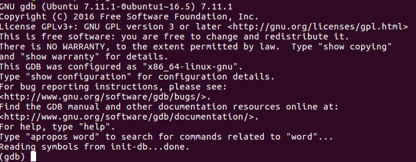
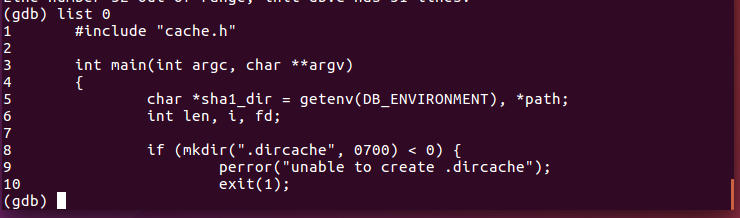
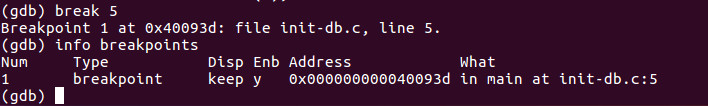

# gdb的使用

先抛出一个前提吧，假设我们编写了一个.c文件叫test.c， 通过gcc的命令 gcc -g test.c -o test 进行编译后，生成了可执行文件。

###### 下面开始进行程序的调试：

###### gdb test

这条命令其实就是进入了调试界面了如果敲了这个命令进入调试界面后的结果如下：

会发现在命令行上方出现了一系列和gdb版本有关的内容，如果不想看到这些内容的话，需要在命令中添加 -q 的选项。

当然也可以选择先gdb -q 进入gdb， 然后输入file test 的方式打开test文件。

###### list 

这条指令可以让你在屏幕上看到源代码，list后面可以跟上许多不同的参数，比如list num 就是可以从第几行开始显示代码，其中默认一次显示10行，如果要继续的话按下enter键即可

当然后面还能跟特定的函数名等等的参数。比如list main。

###### break

设置断点，break linenum, 如果需要查看所有断点的信息则输入命令info breakpoints, 删除断点则用disable命令、clear命令或者delete命令实现

###### run

正式开始调试程序了，程序会停止在你设置的断点处。

如果需要让程序进行下去，可以选择使用continue命令，这样程序会执行到下一个断点处，如果需要一步一步查看程序的执行情况，可以使用step或者next，这两个命令的区别是前者会深入调用函数内部分析，而next则会直接运行函数，不会进入函数体

如果你需要在调试的过程中查看某个变量的值可以使用print指令来打印，如果需要特别设定某个参数的值则使用set指令来设置。

目前需要用的就是这么多吧，后续如果需要再来更新。
