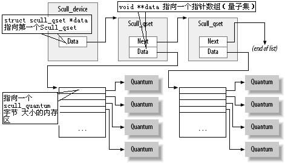

### 2、字符设备驱动程序---scull

##### 主设备号和次设备号

对字符设备的访问通过文件系统内的设备名称进行，通常在/dev目录下。设备文件如果使用ls -l命令查看，则输出的第一列会使用c来标识，如果使用命令展开会发现在中间有两个使用逗号分隔的数字，那就是设备的主设备号和次设备号。主设备号标识驱动程序，次设备号则提供给内核使用。那么在内核中则使用dev_t类型来存储设备号（<linux/kdev_t.h>），它是一个32位的数，前十二位为主设备号，后20位为次设备号。那么如果要取用它们，则要用到<linux/kdev_t.h>中定义的宏：

###### MAJOR(dev_t dev) :主设备号

###### MINOR(dev_t dev) ：次设备号

###### MKDEV(int major, int minor)：转换为dev_t类型。

在建立一个字符设备前，首先要做的事是获得一个或者多个设备的编号，那么需要使用<linux/fs.h>中的register_chardev_region函数。

###### int register_chrdev_region(dev_t first, unsigned int count, char* name)

其中first的次设备号通常为0，count代表请求的连续设备数，name是和编号关联的设备名称。分配成功时返回0，否则返回一个负值。

如果事先不知道设备号，则应当让系统自动分配一个设备号：

###### int alloc_chrdev_region(dev_t *dev, unsigned int firstminor, unsigned int count, char *name)

其中dev就是会返回已分配范围的第一个编号，firstminor则为被请求的第一个次设备号。

如果不再使用该设备，则需要释放设备编号：

###### void unregister_chrdev_region(dev_t first, unsigned int count)

scull中初始化时分配设备号操作如下：

    ```
      int result, i;
      dev_t dev = 0；
    /*
    - Get a range of minor numbers to work with, asking for a dynamic
    - major unless directed otherwise at load time.
    */
      if (scull_major) {
      	dev = MKDEV(scull_major, scull_minor);
      	result = register_chrdev_region(dev, scull_nr_devs, "scull");
      } else {
      	result = alloc_chrdev_region(&dev, scull_minor, scull_nr_devs,
      			"scull");
      	scull_major = MAJOR(dev);
      }
      if (result < 0) {
      	printk(KERN_WARNING "scull: can't get major %d\n", scull_major);
      	return result;
      }
    ```

为了加载一个使用动态主设备号的设备驱动程序，对insmod的调用可以替换为一个简单的脚本，例如源码中的scull_load，这中间有创建设备的操作。

##### 文件操作

目前我们已经获取了一些设备编号，但是还没有将驱动程序的操作连接到这些编号上，file_operations结构就是用来建立这些连接的（活动于内核）。fops中每一个字段都需要指向驱动程序中一个特定操作的函数。该结构存在于linux/fs.h中。

```
/*
 * Create a set of file operations for our proc file.<scull.h>
 */
static struct file_operations scull_proc_ops = {
	.owner   = THIS_MODULE,
	.open    = scull_proc_open,
	.read    = seq_read,
	.llseek  = seq_lseek,
	.release = seq_release
};
```

##### 文件

file结构定义于linux/fs.h中，和C库中的FILE不同。这个结构代表了一个打开的文件，由内核在open时创建，传递给在该文件上操作的函数，知道内核进行close时，所有实例都关闭后释放。

##### inode结构

内核用inode表示文件，file结构则是表示打开的文件描述符。对单个文件，可能会有多个表示打开的文件描述符的file结构，但它们都指向单个inode。

------

#### 字符设备注册

内核中需要使用struct cdev结构来表示字符设备，所以在内核调用设备操作前先要分配并且注册一个或者多个cdev结构，需要包含头文件<linux/cdev.h>，一个普遍的方法：

```
struct cdev *my_cdev = cdev_alloc();
my_cdev -> ops = &my_fops;
```

这种情况下需要使用下面代码初始化分配到的结构：

```
void cdev_init(struct cdev *cdev, struct file_operations *fops)
```

在cdev设置好后，最后的步骤是告知内核结构的信息：

```
int cdev_add(struct cdev *dev, dev_t num, unsigned int count) //num是第一个设备编号,count为关联的设备编号数量
```

从系统中移除一个设备，做如下调用：

```
void cdev_del(struct cdev *dev);
```

scull 中的实现：

```
struct scull_dev {
	struct scull_qset *data;  /* Pointer to first quantum set */
	int quantum;              /* the current quantum size */
	int qset;                 /* the current array size */
	unsigned long size;       /* amount of data stored here */
	unsigned int access_key;  /* used by sculluid and scullpriv */
	struct semaphore sem;     /* mutual exclusion semaphore     */
	struct cdev cdev;	  /* Char device structure		*/
}; // scull 设备结构
/*
 * Set up the char_dev structure for this device.
 */
static void scull_setup_cdev(struct scull_dev *dev, int index)
{
	int err, devno = MKDEV(scull_major, scull_minor + index);
    
	cdev_init(&dev->cdev, &scull_fops);
	dev->cdev.owner = THIS_MODULE;
	dev->cdev.ops = &scull_fops;
	err = cdev_add (&dev->cdev, devno, 1);
	/* Fail gracefully if need be */
	if (err)
		printk(KERN_NOTICE "Error %d adding scull%d", err, index);
}
```

##### open 和 release 方法

###### open方法

这个方法提供了驱动程序初始化的能力，从而为以后的初始化做准备。它需要完成：检查设备特定错误；初始化；更新f_op指针；分配填写file->private_data数据结构。首先我们要打开对应的设备，open原型：

```
int (*open)(struct inode *inode, struct file *filp);
```

虽然在inode的i_cdev中有cdev结构，但是我们希望得到的是整个scull_dev结构，在<linux/kernel.h>中的container_of宏中实现了：

```
container_of(pointer, container_type, container_field)
```

scull中的实现：

```
/*
 * Open and close
 */

int scull_open(struct inode *inode, struct file *filp)
{
	struct scull_dev *dev; /* device information */

	dev = container_of(inode->i_cdev, struct scull_dev, cdev);
	filp->private_data = dev; /* for other methods */

	/* now trim to 0 the length of the device if open was write-only */
	if ( (filp->f_flags & O_ACCMODE) == O_WRONLY) {
		if (down_interruptible(&dev->sem))
			return -ERESTARTSYS;
		scull_trim(dev); /* ignore errors */
		up(&dev->sem);
	}
	return 0;          /* success */
}
```

###### release 方法

和open方法相反，他的作用是：释放open分配的file->private_data中的所有内容；关闭设备

##### read 和 write 方法

拷贝数据到应用程序空间和从应用程序中拷贝数据。函数原型：

```
ssize_t read(struct file *filp, char __user *buff, size_t count, loff_t *offp)
ssize_t write(struct file *filp, const char __user *buff, size_t count, loff_t *offp)
```

count是请求传输数据的长度，buff指向了用户空间的缓冲区，offp指向用户在文件中进行存取操作的位置。**注意的是，buff是在用户空间上的指针，内核代码不能直接引用**

###### read方法

返回值为count，则传输成功完成；如果返回值为正且小于count，则说明部分文件读取成功；返回值为0说明已经到达文件尾部，如果出现负值则出现了错误。

```
ssize_t scull_read(struct file *filp, char __user *buf, size_t count,
                loff_t *f_pos)
{
	struct scull_dev *dev = filp->private_data; 
	struct scull_qset *dptr;	/* the first listitem */
	int quantum = dev->quantum, qset = dev->qset;
	int itemsize = quantum * qset; /* how many bytes in the listitem */
	int item, s_pos, q_pos, rest;
	ssize_t retval = 0;

	if (down_interruptible(&dev->sem))
		return -ERESTARTSYS;
	if (*f_pos >= dev->size)
		goto out;
	if (*f_pos + count > dev->size)
		count = dev->size - *f_pos;

	/* find listitem, qset index, and offset in the quantum */
	item = (long)*f_pos / itemsize;
	rest = (long)*f_pos % itemsize;
	s_pos = rest / quantum; q_pos = rest % quantum;

	/* follow the list up to the right position (defined elsewhere) */
	dptr = scull_follow(dev, item);

	if (dptr == NULL || !dptr->data || ! dptr->data[s_pos])
		goto out; /* don't fill holes */

	/* read only up to the end of this quantum */
	if (count > quantum - q_pos)
		count = quantum - q_pos;

	if (copy_to_user(buf, dptr->data[s_pos] + q_pos, count)) {
		retval = -EFAULT;
		goto out;
	}
	*f_pos += count;
	retval = count;

  out:
	up(&dev->sem);
	return retval;
}
```

###### write方法和read方法类似

```
ssize_t scull_write(struct file *filp, const char __user *buf, size_t count,
                loff_t *f_pos)
{
	struct scull_dev *dev = filp->private_data;
	struct scull_qset *dptr;
	int quantum = dev->quantum, qset = dev->qset;
	int itemsize = quantum * qset;
	int item, s_pos, q_pos, rest;
	ssize_t retval = -ENOMEM; /* value used in "goto out" statements */

	if (down_interruptible(&dev->sem))
		return -ERESTARTSYS;

	/* find listitem, qset index and offset in the quantum */
	item = (long)*f_pos / itemsize;
	rest = (long)*f_pos % itemsize;
	s_pos = rest / quantum; q_pos = rest % quantum;

	/* follow the list up to the right position */
	dptr = scull_follow(dev, item);
	if (dptr == NULL)
		goto out;
	if (!dptr->data) {
		dptr->data = kmalloc(qset * sizeof(char *), GFP_KERNEL);
		if (!dptr->data)
			goto out;
		memset(dptr->data, 0, qset * sizeof(char *));
	}
	if (!dptr->data[s_pos]) {
		dptr->data[s_pos] = kmalloc(quantum, GFP_KERNEL);
		if (!dptr->data[s_pos])
			goto out;
	}
	/* write only up to the end of this quantum */
	if (count > quantum - q_pos)
		count = quantum - q_pos;

	if (copy_from_user(dptr->data[s_pos]+q_pos, buf, count)) {
		retval = -EFAULT;
		goto out;
	}
	*f_pos += count;
	retval = count;

        /* update the size */
	if (dev->size < *f_pos)
		dev->size = *f_pos;

  out:
	up(&dev->sem);
	return retval;
}
```

*向量级别的读写参考函数readv和writev*

------

#### scull设备的布局



