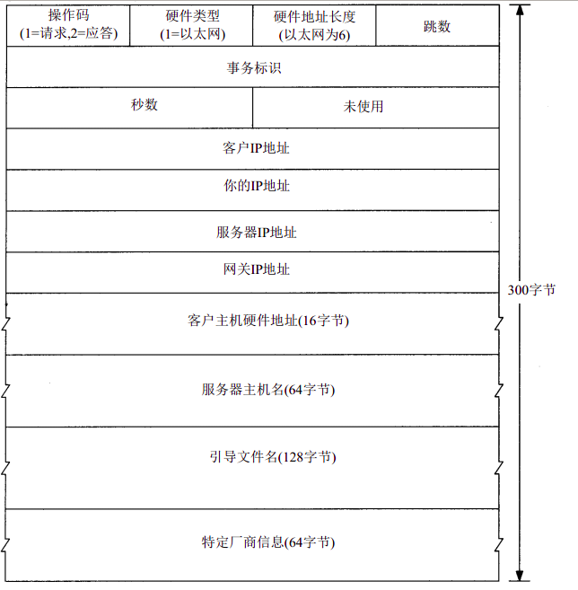

# BOOTP

BOOTP：BootStrap Protocol 初始化启动协议

这个协议本质的目的是为了让一个无磁盘系统启动获取必要的IP地址等信息。在RARP协议中有提到，一个无磁盘的系统可以通过RARP协议获取它的IP地址，但是那仅限于局域网中，如果存储这台主机的信息不在改局域网中，那么就需要BOOTP协议来帮忙了。

BOOTP协议也是作为UDP的负载，它的报文格式如下：

简单讲一下：首先操作码很好理解，1代表请求报文，2代表回应报文；硬件类型其实和arp中一样，其中1代表以太网，然后紧接着会给出自己的物理地址，跳数在客户端发送报文时置为0，它会被用在代理服务器上；标识的作用依旧是让客户端和服务器端来确认某个包；秒数则是记录了客户端启动使用的时间；接下去的几个域：客户IP地址一开始会置为0，因为你并不知道，如果你知道了就可以置为你的IP地址；你的IP地址是由服务器给你填上的，一般在回应报文里给出，服务器IP地址不用多说，网关IP地址是指这个报文如果途中经过一个路由器的转发，就需要由那个路由器填入网关IP地址，客户主机硬件地址也不用多说；服务器主机名可以选择性的被服务器填入；引导文件名指示客户端的引导文件在服务器具体的位置，这个位置有利于后续客户端使用TFTP协议拿取。最后特定厂商信息包含了一些额外信息，包括子网掩码，网关信息，DNS信息等等。

这个协议使用的方法也很简单：客户端在启动时发送请求报文，然后将自己的硬件地址广播出去，当服务器受到后给与回应，这个回应中带有这个客户端的IP地址。

那么这个过程中有几个问题需要讨论：

1. 这个协议使用UDP进行传输，默认客户端使用68端口，而服务器使用67端口，这样服务器受到请求报文无需比对包类型，并且可以直接从包内拿到物理地址，相较于RARP协议更为方便。
2. 对于服务器端而言，发送回应包是一个比较有趣的问题，因为回应包同样是使用UDP进行传输，在传输之前可能会用到arp协议查找客户端，但是这时客户端并没有自己的IP地址，因此对于服务器而言要么1）默认在自己的arp cache中填入映射关系 。2）广播这个回应包，让客户端去接收。
3. 这个包是能够被路由器所转发的，中间路由器所需要做的事情就是要在包内填入网关IP地址和增加跳数。