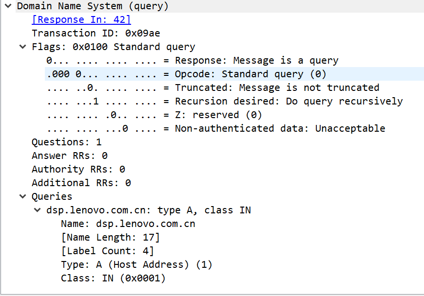
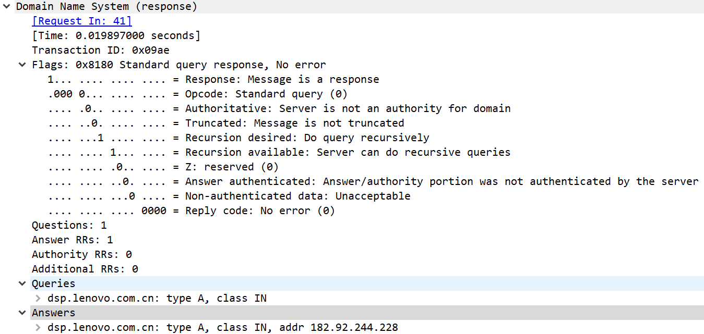

# DNS

DNS --- Domain  Name System(域名解析系统)

DNS准确的说它是一个分布式的数据库，里面存储的是IP地址和域名之间的映射。从一个应用程序的角度来看，应用程序需要调用系统中的解析器来进行解析，由它来和域名服务器来通信。

首先你得要知道的一点是，DNS域名空间是一个树结构，类似于unix系统的文件系统，只不过文件系统是从上而下，而域名系统是从下而上。域名系统有一个根结点，然后下面是顶级域，在顶级域中有arpa（用于地址向域名的解析），7个通用域（com,edu,gov,int,mil,net,org），和国家域（cn,ae,us...），再下面就是二级域，然后以此类推。每一个结点上的标签最多为63个字符。

**FQDN: fully qualified domain name 全域名**

域的概念是指DNS树的一棵子树，域中需要所谓域名服务器来授权这个域，当然一个域名服务器是可以同时授权多个不同的域的，一个域必须与一个初始域名服务器和多个二级域名服务器相关联。为什么要设计这么多域名服务器？如果只设置一个域名服务器，则突然它宕机了就很麻烦，如果多个域名服务器的话其中一个宕机了还有机会补救。那么初始域名服务器的本地磁盘中就保存了所有域名解析的信息，而二级域名服务器就需要时刻去请求域名解析信息。当然一个域名服务器是不可能知道所有其他服务器的位置的，但是有一点要说明就是，它绝对知道根域名服务器的位置，根服务器全世界也就那几个。

#### DNS报文结构

在使用DNS时依旧要发送请求和响应，报文格式如下（这次直接看抓包的内容）：

上面是请求报文

上面是响应报文

其中第一个域为Transaction ID也可以是Identification，即标识了该报文，响应和请求报文中的该域应该一致；接下去是一个flag标志域，可以看到其中：第一位0代表查询，1代表回应；后面四位opcode一般默认置0；AA是指授权回答；TC指的是判断包内容是否溢出，上层协议如果是UDP则可能限制负载为512字节，如果移除该为置位；RD表示该请求是一个递归请求；RA代表服务器是支持递归请求的；后面三位默认为0；最后四位用来判断请求和响应中是否出现了错误。

报文的接下去8个字节分别是请求的个数，回复的个数，授权服务器个数和附带信息个数。

然后是请求请求域：分三个内容，域名，请求类型以及请求类，请求类型在后面会详细说，这里请求类默认置1.

回复域：分为6个内容：域名，类型，类（这三个和请求中的一样），TTL指的是这一条记录在cache中的存活时间。数据长度代表回复中附带的数据的长度，然后就是回复的数据。

##### 讲一下这中间的Type吧

这个指定了域名服务器中记录资源的类型，这也出现在请求报文中要说明你需要请求对象的类型：

* A: IP地址
* PTR： 指针查询中使用的指针记录
* CNAME：缩略名，可以说是域名的别名
* HINFO：主机信息
* MX： 邮件交换记录
* NS：域名服务器记录

#### 指针查询

其实这东西我一开始是真的云里雾里。这个的作用是由IP地址反查出这个IP地址对应的域名信息。简单的说在我们每一个系统加入某个域后，其实在之前提到的arpa结点下的in-addr结点下注册对应的IP地址，假设有一个主机的地址是110.111.112.113，那么注册后得到的域名就是113.112.111.110.in-addr.arpa。其实这个有一定的规律可循，因为最靠近in-addr的结点依次可以对应ABC类地址。解析的事情就交给解析器去做了。

#### DNS缓存

所有的域名服务器都会有一个缓存，缓存的目的无非就是加快效率，避免重复的多余的操作。那么如果一个域名服务器开始的时候什么都没有，它是怎么处理一个dns请求的呢？

首先它必然知道根域名服务器的地址，向他发送一个请求，这个时候注意这个请求不是所谓的递归查询了，因为它和上面的查询的性质不同，它的目的是一级一级查询授权的服务器。这时根域名服务器会返回一系列授权的域名服务器，这时主机就可以向其中一台域名服务器继续发送请求，然后以此类推。

查询过程中查询到的结果会存入DNS缓存中。

#### UDP or TCP

一般DNS报文都是使用UDP来传输的，但是很多情况下也会使用TCP，就例如TC位置位下，很显然一个UDP报文无法承载下RR了，那么就会选择使用TCP来进行传输；包括我们在上面提到的二级域名服务器向初始域名服务器请求域名内容时也会使用TCP

----

## DNS污染攻击

实验！！！！！！！！！！1

