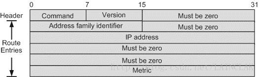

# Dynamic Routing Protocol

Dynamic Routing Protocol 动态路由协议

这个不是一个单独的协议，是一类协议的总称。这些协议区别于之前在IP中讲到的路由，那些路由属于静态路由，适用于简单的网络，如果每个网络设备都是进出都只有单独的一个接口。但是如果网络一旦庞大，则静态路由将很难处理路由信息，这就需要动态路由的帮助。**要注意的是动态路由路由器选择路由的方式还是查看路由表，然后选择路由，这一点并没有改变；动态路由只是实时更新每个路由器中的路由表，选择最好的一条路由，这个工作由路由守护进程（routing deamon）完成**

而这里需要对网络进行一个小划分。大多数情况下，在一个小集团比如学校等都会使用内部相同的一个路由协议，这样的组织网络给它一个新名字，叫做自组织系统（autonomous systems， ASs），在这些AS中使用的路由协议称为内部网关协议（interior gateway protocol, IGP），那么外部的协议也就叫外部网关协议了（exterior gateway protocol,EGP）。

## RIP：Routing Information Protocol 路由信息协议

RIP报文的内容是嵌在UDP报文负载中发送的，报文格式如下：

其中Command命令指的是协议类型，1为request，2为reply；Version为版本号，目前由V1和V2两种。address family identifier默认为2，指IP地址；Metric指的是跳数。

具体的做法如下：

1. 刚开始启动时，守护进程确保每个接口都开启，则它会从每个接口发送一个请求包（如果可以广播就广播），请求其他路由器的完整路由表，目的地端口号为520，报文中address family identifier为0 且metric域为16代表一个特殊的要求完整路由表的报文。
2. 当收到了请求后，如果是一个特殊的报文，则返回完整路由信息；否则只返回指定地址的路由信息和跳数，否则跳数为16（不可达）
3. 收到相应后改变路由表信息；
4. 每隔30秒广播一次路由表信息给相邻的路由器；
5. 当收到的报文中metric域发生变化，则修改路由表信息。

这个跳数就是指中间所要通过的路由器的数目。RIP的几个缺陷是：它无法判断一个地址的子网号；并且它在链路出现问题后也需要一段时间稳定，这可能会导致链路循环问题。

## OSPF: Open Shortest Path First 开放最短路径优先

OSPF和RIP很不一样，RIP可以称为是一种距离向量协议，它通过路由器之间的向量来控制路由信息。OSPF不需要像RIP那样时刻要告诉相邻的路由器链路信息，它们自己就会维持一张全局的路由表信息。这个方法的好处是弥补了RIP稳定时间慢的不足，它能更为快的更新链路信息。**OSPF不需要TCP或者UDP的支撑，它直接使用IP，它在IP的协议种类域中有单独的类型号。**

## BGP: Border Gateway Protocol 边界网关协议

这个协议的目的是控制两个AS直接的路由，取代了之前的EGP协议，它使用TCP进行传输。一个BGP系统需要和其他BGP系统交换信息，这些信息包括了自组织系统中的所有路径信息。我们可以将只在一个AS中传输的IP报定义为本地传输，而其他的则成为路由传输，我们可以把AS分为以下三类：

1. 桩AS：只和一个外部AS连接，意思是桩AS只负载本地传输；
2. 多重AS: 和多个外部AS连接，但是不会负载路由传输；
3. 传输AS：和多个外部AS连接，并且负载路由传输；

这样桩AS和多重AS并不需要运行BGP，它们只需要使用EGP和传输AS进行信息交换。这里有几个注意点：首先BGP可以人为进行设置，在有多种路径选择的条件下认为规定路径；其次两个系统运行BGP需要建立TCP连接，来交换BGP路由表；BGP也是一个距离向量协议，但是它并不是使用跳数，而是使用途径的AS数。

## CIDR: Classless interdomain Routing 无类别内部路由

使用B类地址划分为C类地址带来一个问题，每一个C类地址都需要一个路由信息，这样路由表就非常庞大。CIDR的作用就是有效避免这样的问题。它的做法是，如果某些被分配的网络可以合并，那么就是用单独的一条路由信息来表示。CIDR使用最长匹配的技术，它匹配拥有最大子网掩码的路由信息。使用这个技术为什么是无类别的呢？那是因为路由不再依靠ABCED类地址来进行选择了，而是通过IP地址直接进行路由的选择，有效缩短了路由表的长度。