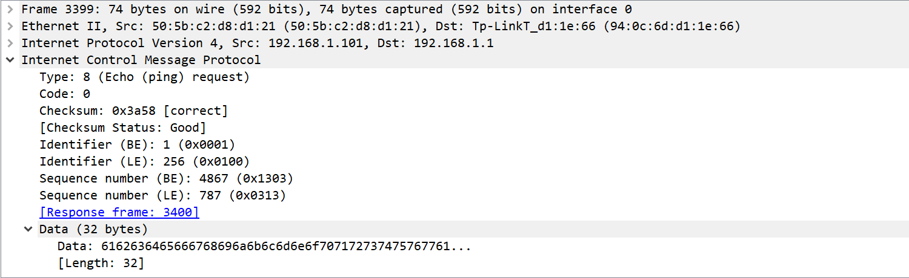

# ICMP协议

icmp协议：internet control message protocol 网络控制信息协议

作用：这个协议是被封装在IP报文中的。IP协议是一个尽力而为的协议，它的可靠程度很难保证，而ICMP协议往往配合IP协议，传递网络传输中出现的一些状况的信息，包括错误信息和一些其他类型的信息，使得主机对发送的报文状况有所了解。

###### 有个注意点说在前面，ICMP错误信息的应用场景有一些特殊的地方，它无法应用于返回一些广播包的控制信息，这样做会导致广播风暴的出现。

报文格式：

ICMP协议的type域控制了这个报文的类型，而code域则说明这是该种类型报文中的第几种类型的报文，例如图中是最经典的ping request报文，它的type和code域分别为8和0。checksum域是对icmp协议做校验，和ip报文中的checksum域类似。

###### ICMP错误信息中，在生成错误负载的时候必须包含至少8字节的IP报文内容

###### 谈谈几种比较经典的ICMP协议：

###### 1、子网掩码获取和回复

这个通常用于一个无磁盘的系统要获取它的子网掩码时，需要广播它的ICMP请求。

###### 2、时间戳获取和回复

向其他主机获取时间戳

###### 3、端口不可达

