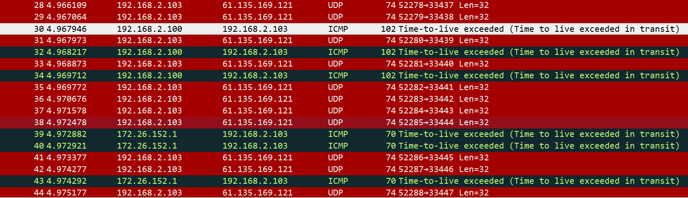
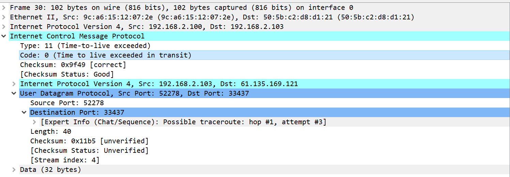

# ICMP协议

icmp协议：internet control message protocol 网络控制信息协议

作用：这个协议是被封装在IP报文中的。IP协议是一个尽力而为的协议，它的可靠程度很难保证，而ICMP协议往往配合IP协议，传递网络传输中出现的一些状况的信息，包括错误信息和一些其他类型的信息，使得主机对发送的报文状况有所了解。

###### 有个注意点说在前面，ICMP错误信息的应用场景有一些特殊的地方，它无法应用于返回一些广播包的控制信息，这样做会导致广播风暴的出现。

报文格式：

ICMP协议的type域控制了这个报文的类型，而code域则说明这是该种类型报文中的第几种类型的报文，例如图中是最经典的ping request报文，它的type和code域分别为8和0。checksum域是对icmp协议做校验，和ip报文中的checksum域类似。

###### ICMP错误信息中，在生成错误负载的时候必须包含至少8字节的IP报文内容

###### 谈谈几种比较经典的ICMP协议：

###### 1、子网掩码获取和回复

这个通常用于一个无磁盘的系统要获取它的子网掩码时，需要广播它的ICMP请求。

###### 2、时间戳获取和回复

向其他主机获取时间戳

###### 3、端口不可达

------

#### ping 程序

这个程序的目的一般是为了判断某个主机是否存在或者是否可达。可以看到在上面截取的icmp报文中还有两个域值得关注，一个是identifier（识别号），一个是sequence num（序列号），在ping程序中要求reply中要包含域request中相同的域内信息，这是为了区分多个ping程序的原因。在Unix系统中identifier域内的信息就是ping程序的进程号。

特别需要注意的是，如果我们是在ping hostname时，会出现第一行例如hostname （IP号），这样的字样，然后会间隔一段时间显示ping的信息，那是因为DNS在解析域名。

在局域网中使用ping指令时，你有时又会发现第一条ping命令的time会比其他稍微长一点，那有可能是因为需要arp解析。

icmp -R 这个命令的作用是在发送icmp request包中的option域中加入一个list，当途中每过一个路由器，该路由器将它的出口地址填入表中，然后直到最后一个主机时，将它的入口地址填入表中之后，将该表信息填入reply包中的option域内发还。（测试中未成功）

还存在一种时间戳ping程序，但是也未成功，和上述-R命令类似，只不过将option部分换成了时间戳。

#### traceroute 程序

1、客户端发送一个TTL为1，端口号大于30000的UDP数据包，到达第一站路由器之后TTL被减去1，返回了一个超时的ICMP数据包，客户端得到第一跳路由器的地址。

2、客户端发送一个TTL为m的数据包，在m跳的路由器节点处超时，得到第m跳路由器的地址。

3、客户端发送一个TTL为n的数据包，数据包成功到达目标主机，返回一个**端口不可达**错误，traceroute结束。

###### 需要与ping -r 指令区分的是，traceroute指令得到的每个路由器的入口地址，和ping -r不同。

实验结果如下： traceroute www.baidu.com  (ubuntu)

你可以看到确实如上述实现中所指出，我们可以看到一个明显的TTL exceeded标志，并且上层协议是UDP，他的端口确实是一个比较大的端口。

那么在实验中，你也许会使用windows上的tracert程序来实验，看看是不是能取得同样的情况。很遗憾，在windows10上试验后并没有得到上面同样的情况，你无法从中抓取UDP的包内容。也就是说这两个traceroute程序的实现并不相同，一个是基于udp的实现，也就是一开始提到的，另一个则是字节通过ICMP报文实现的。

###### 实验中出现了一个小问题，就是出现你无论如何traceroute到任何的网站，在结果中只会返回一跳数据。这很有可能和路由器本身有关。

###### 补充：

在traceroute程序中有两种特殊选项，分别为严格IP路由选项和松弛IP路由选项，前者是通过-G（linux）的选项来限制某个路由必定要通过某个路由器，如果途中并没有办法到达下一个路由器则会返回一个源地址错误的ICMP错误报文；后者通过-g（linux）或者-j （windows）也是控制途中必须经过的路由器地址，只不过它可以选择跳过其中的一些路由选项。那么如果你想知道当你和一个主机通信时发送报文和接受响应时路由是否相同，就可以通过松散路由的方式来判断。这里要注意的是，在指令后面必须添加点分十进制的地址而不是直接写上主机名，这个原因和DNS解析的性质有关。