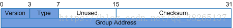

# IGMP

IGMP  --- Internet Group Management Protocol（网络组管理协议）

这个协议的作用是为了让网络中的系统知道，哪些主机属于某一个多播组，这个功能要依靠多播路由器的实现。

IGMP和ICMP类似，它直接负载于IP协议内，所以直接通过IP协议进行传输。

**报文格式**

在这个报文中version就是这个协议的版本号，type域有两种可能，当其为1时说明该报文为路由器发送的查询报文，如果是2则说明是主机的响应报文。checksum为校验和没什么说的。Groupaddress是一个组播IP地址

**这里强调的是，我们认为加入一个组播组的是一个主机上某一接口上的某一进程，这个进程可以随时进退这个多播组。组中的成员是和某一个接口有关的，一个进程从多个接口加入同一个组。因此主机必须可以识别组播地址和接口地址，即它需要建立一张表维持进程对应的所有组和某个组的相关进程数**

这个协议遵守如下的规则：

1. 主机会在第一个进程加入某个多播组时发送一个IGMP通报，如果有多个进程加入同一个组也只会发送第一个通报。
2. 当一台主机上某个进程离开这个组时是不会发送任何报文的，哪怕最后一个进程离开时也不会。
3. 组播路由器会间歇性的发送IGMP查询报文，来询问网络中是否还有哪些进程是在某个组的，IGMP报文的组播地址会置为0.
4. 主机受到了IGMP查询报文后会发送IGMP通告报文告诉组播路由器，如果主机上还存在某个在组内的进程。

**值得注意的是，组播路由器其实并不关心哪个主机对应哪个组，它更加关心组内是否还有某个主机对应的进程**

