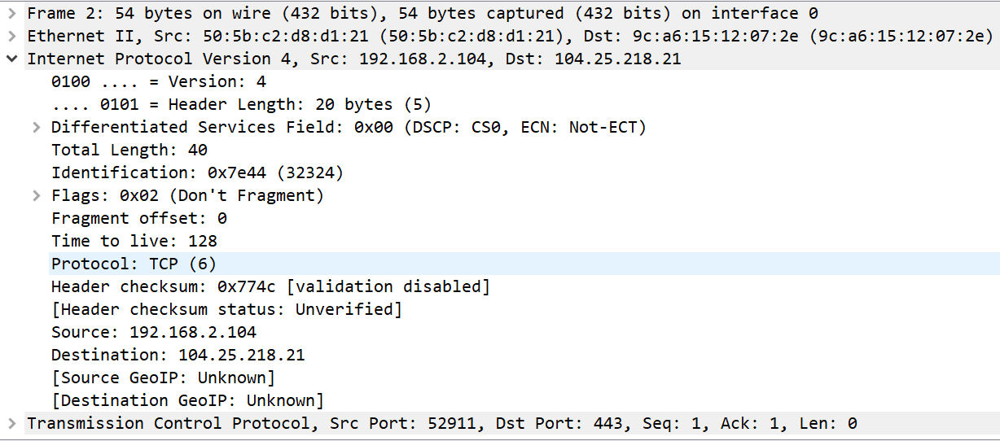

## IP 协议

ip协议：Internet Protocol 网际协议

这个协议怎么说呢，觉得应该是协议簇里比较重要的一个部分，它活动于网络层，主要的作用是为了传递数据报，达到路由的功能。ip协议有一个非常常见的说法，它是一个不可靠的无连接的尽力而为的服务，它可能会将传输的数据包丢弃，收到的数据包可能会是无序的，当然可靠性和顺序的操作就会交给上层协议来实现。

###### IP报文格式：

通常IP报文头部的长度是20个字节，包含了版本，头部长度，TOS（服务类型），总长度，标识，标志位，段偏移，TTL（生命周期），上层协议，校验和，源IP和目的IP

版本号指的是IP协议使用的版本，例如目前常用的还是IPv4；头部长度指除去数据外的报文长度，包括了选项部分；TOS可以为不同情况下的报文提供不同的服务，前四位用作指示服务类型，后四位默认为0，如果是普通类型报文，则默认全为0，否则一共有四种不同的服务：最小延迟服务，最大吞吐量服务，最大信赖度服务和最小成本服务；总长度为IP报文的总长度；后面三个标识，标志和段偏移和IP的分片有关，而为什么要进行IP分片？这和链路层存在MTU有很大关系，这个要详见链路层，后面详细介绍；TTL是报文的生命周期，每过一个路由器则减1，这个变量的目的是防止出现路由循环，如果TTL为0时且没有到达目的地则自动丢弃；上层协议指IP的负载协议是什么，例如之前提到的ICMP和下图中的TCP； 校验和是指IP头部进行CRC校验得到的校验和。报文的实际长相可以参考下图：

------

#### IP路由

抛开报文先来看一下IP报文最基本的功能，也是最重要的功能，路由功能。

简单的说IP路由需要想办法指明发送的报文下一步应该发向何处。网络上的设备中一般保存着一张路由表，那么当网络接口收到报文时，它首先应当检查目的IP是否为本机地址或者广播地址，如果不是则交给网络层，那么网络层需要做什么呢？这个要分路由器和主机两种情况，路由器会根据路由表转发，而主机则会丢弃。

路由表如下图所示：

这个是windows下的路由表信息，和linux下的有些不同，大致内容包括了目的IP地址，网关，接口信息还有标志位等等。

有了路由表，如何去查找数据包下一跳去往何处？首先设备会查找和目标IP主机号和网路号都吻合的路由信息，如果没有查到，则设备会查找和目的IP网络号相同的路由信息，如果还没查到则选择其中的default路由，也就是默认路由（当没有其他匹配的情况下默认选择这一条路由），如果还没有找到合适的，则返回一个主机不可达的错误信息（ICMP）。**当然值得注意的是数据包的传递中目的IP是不会变的，但是物理地址会发生变化。**

##### 子网划分

IP地址的划分开始是划分为ABCDE五类，这里不详细说了，这五类最好的区分方式就是看点分十进制的第一个十进制数，每一类都有一个固定的范围。随着互联网的发展，联网的用户越来越多，而一般大多申请的IP地址都属于C类地址，这样C类地址逐渐不够使用，但是会发现针对企业和组织使用的A类和B类地址其实并没有被完全充分利用，所以要进行子网划分，这样原本的由网络号和主机号构成的IP地址变成了由网络号、子网号和主机号三者构成的IP地址。

##### 子网掩码

这样单纯的划分会出现问题吗？毕竟进行划分是组织内部的事情，那么难免会出现IP地址看起来相同，却表示着不同IP的情况，怎么区分它们为不同的IP地址也是一个问题，所以出现了子网掩码这个概念。子网掩码将该IP网络号和子网号部分全置为1，主机号部分置为0。要想知道该IP的子网地址只需要和子网掩码进行与运算便可。**注意一个问题，这里子网掩码的目的是为了获取子网号，而不是网络号，网络号是在IP中默认就知道的。**

##### 回到路由

那么真实情况下的路由可以这样描述：

1、如果该主机没有接到网络，那它发送的包将直接交给回环接口；

2、如果该主机接到了局域网上，则路由表中只会出现回环接口地址和局域网内地址；

3、如果该主机接到了一个单独的路由器上，很有可能它的路由表中存在一个默认路由；

4、普遍情况，路由表中存在其他路由情况。

这边有一个细节问题，就是如果一个报文是交付给本机地址或者是回环地址，结果是一样的，那么过程是否一样呢？这个是不一样的，交付给本机地址的话，数据包还是会下发给到链路驱动处然后判断到和本机IP相同则交付给回环接口，后者直接会被交付给回环接口。

一个主机的路由表通常是已经写在主机系统文件中的，初始化时只需读取即可，当然在初始化时你也可以通过命令来修改。

##### 接下去说一些和ICMP相关的问题了

这部分比较纠结写在哪里比较合适，不过既然和IP路由相关，那么就写在这里也无妨。

###### 路由找不到呢？

如果真的出现无法到达指定的IP地址的情况，那么如果这个报文是在该主机上组成，并且发现无法到达，则会直接返回一个错误信息；如果该报文正在通过一个路由器进行路由发现无法到达，则会返回一个ICMP错误报文（host unreachable or network unreachable）

###### 路由重定向

现实中的路由中可能会出现这样的问题：

在host中的路由表中没有到达route2的路由，现在希望发送报文给route2，而host中存在到达route1的报文，并且route1包含route2的路由。有趣的是，route1接收host发送的报文和route1发送给route2报文使用的接口是相同的，这就相当于这一个交付的过程是多余的。当route1发现了这样一个事实，会发送一个重定向的ICMP报文，这个报文的作用是让主机可以更新其路由表信息，这样就不会出现这样多余的交付过程了。

###### 再谈路由的初始化

初始化路由表一般都是直接从系统配置文件中获取，其实还存在着一种方法，使用ICMP通告和请求报文（RFC1256）。简单的说，路由器会发送通告报文（广播或者多播）给主机，主机则会在启动时发送请求报文，路由器因此会响应主机的请求报文，而主机也根据路由器的响应来配置自己的路由情况。路由器也是有优先级别的，如果一个主机收到了多台路由器的通告，则根据优先级来确定路由。