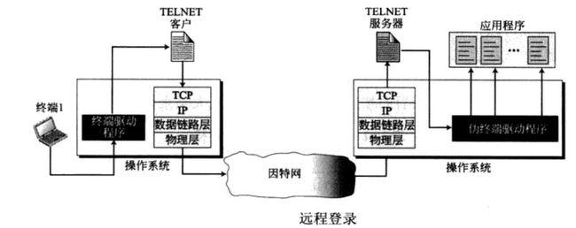

# Remote Login

Remote Login: 远程登陆

## Rlogin Protocol：

最初设计Rlogin是只想在UNIX系统上运行的，因此设计比较简单。

它在客户端和服务器之间使用一个tcp连接。接着应用程序会操作：

1. 客户端必须要写入四个字符串
   * 一个0
   * 客户端主机的登录名
   * 服务器端主机的登录名
   * 用户客户端终端的类型，和终端的速度
2. 服务器会返回一个0
3. 服务器会让客户端输入密码，如果客户端没有在限定时间内输入密码，则直接关闭连接
4. 服务器发送一个请求询问客户端终端的窗口大小。

这里有几个命令在客户端和服务器端传送，还是需要注意的。

* 首先是流量控制命令一般是control-s和control-q，这个命令一般的作用是通知服务器客户端终端不再输出了，这个命令要注意的一点是。如果这个步骤不做，则当我们按下了control-s后仍然会在终端上打印许多缓冲区中的数据。
* 客户端中断，一般的命令是control-c，这个实现中也和流量控制类似。
* 窗口大小改变，窗口改变发生在客户端，但是应用程序运行在服务器端，所有客户端需要通知服务器窗口改变的参数。
* 一些服务器要告诉客户端的命令，其中包括刷新缓冲区命令，告知客户端要更新窗口大小的命令等。（带外传输），那么一般客户端告知服务器端的命令就属于带内传输。
* 客户端esc，这个命令的意思是用户只想和客户端程序沟通，而这些信息不会发送给服务器。

当我们按下了control-s的时候这个时候需要完成流量控制，即客户端阻塞终端的输出，然后此时接收窗口也会被填满，这样发送端无法继续发送数据，这样在服务器端的进程也会终止。然后将命令发送给服务器端，这个时候服务器端会通知应用程序需要暂停输出了，这样输出的缓存会被刷新，同时向客户端发送刷新缓冲区的命令。

## Telnet

telnet可以使用在任何类型的主机和任何类型的终端上，它的实现借助了一个叫做网络虚拟终端的东西（NVT），这个NVT中是一个字符设备，它有一个键盘和一个打印器，那可以知道输入要用到键盘，回显要用到打印器。

telnet两边通信都使用带内传输，它在每条命令开始都有IAC（0xff），然后跟上指令内容。telnet比较有意思的部分是指令协商部分，它需要四个语句帮助它来协商：WILL（发送者想要做的事），DO（发送者想要接收者做的事），WONT（发送者不会做的事），DONT（发送者让接收者不会做的事），在这些语句后面跟着的是选项ID，就是希望做的事的类型。

对于telnet而言还有一个注意点就是，Rlogin中当我们敲打命令时，默认每打一个字符传输一次。而telnet他可以有多种模式，包括每次传输一个字符，或者每次传输一行等。