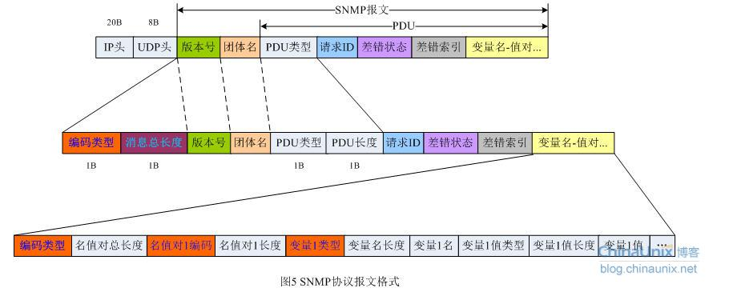

# SNMP

SNMP协议：Simple Network Management Protocol(简单网络管理协议)

随着接入网络中的系统以及组织越来越多，就需要很好地去管理这些成员，而SNMP协议就是用来做这个的。首先知道在网络中跑这个管理软件的称为代理，管理者通常会通过这些代理去监视网络情况。

在讲协议之前要先了解一下这个协议中有三个组成部分：

**MIB** 信息管理元，制定了网络元素中应该保存的变量。

**SMI** 一系列和这些变量有关的识别身份的框架和结构

**SNMP** 管理员和这些元素之间的协议

## 具体协议

在这个SNMP中一共定义了五种信息可以在管理者和代理之间传递：

1. get-request操作：抓取一个或多个变量的值；
2. get-next-request操作：抓取下一个或多个指定变量的值；
3. set-request操作：给一个或者多个变量赋值；
4. get-response操作：返回一个或者多个的值；
5. trap操作：某个代理告知管理者某件事件的发生；

前三个操作都是管理者发给代理的，使用的是UDP端口号为161；代理发送trap操作使用UDP端口为162。

版本号的计数比较特别，它是当前这个协议版本号减1，比如SNMPv1的版本号为0；团体名community是一个和管理者和代理相关的一个字符串，一般是 6个字符组成的public；PDU类型值包的类型，对应之前说的5个类型；requestID就像identification域类似，是这个包的标识。错误状态是由代理指定目前发生的错误；对应的错误状态索引会存在差错索引中。

#### 数据类型

在SNMP中只有一部分类型的数据，这里也不展开一个个说了，它们分别是：INTEGER，OCTET STRING， DISPLAYSTRING， OBJECT IDENTIFIER， NULL, IPADDRESS, PHYADDRESS, COUNTER, GAUGE, TIMETICKS, SEQUENCE，SEQUENCE OF。

## MIB

总的来说，MIB是由代理维护的，管理者可以查询和设置的一个数据库信息，它的object identifier为1.3.6.1.2.1。一个MIB也被非为了多个不同的组，包括系统，接口，IP等等。这里的标识的意思是MIB数据库你可以看成是一棵树，从上至下开始便利，那么MIB结点数据便利到的结点用点分字符串标识就是1.3.6.1.2.1，每一个数字代表该结点的标识。如果你想要标识某一个结点的值，在末尾加上.0,如果需要标识一个表格数据，需要讲表格的数据组合后跟在这个object identifier上；**注意遍历表格是column-row顺序，意思是使用next命令时先遍历列后遍历行**

### ASN.1 和 BER

ASN.1是SNMP正式的指定标准并且真正指定了SNMP信息每一位编码的我们称它为BER。ASN.1是指定了数据描述和数据资源的一种正式语言，在MIB的所有域和SNMO信息都是使用ASN.1来描述的。而这个BER就将该语言组成的数据编码然后进行传输。

