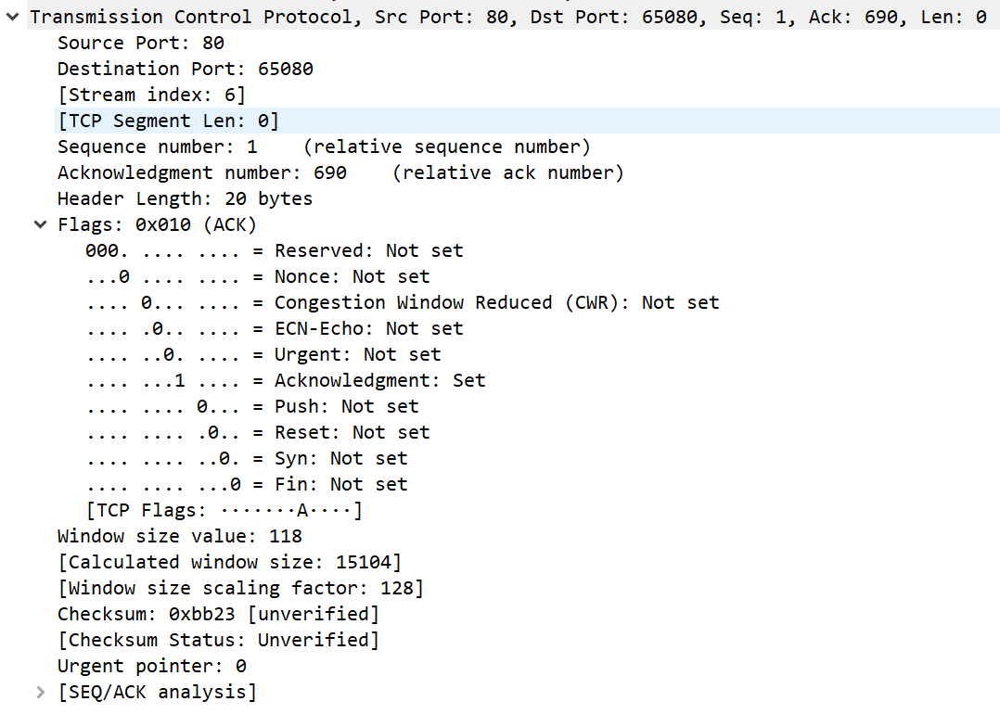

# TCP

TCP: transmission control protocol 传输控制协议

TCP属于传输层协议，和UDP在同一层，但是它和UDP所给的服务是不同的，TCP给的服务是一种面向连接的端到端的可靠数据流服务。面向连接是指它会和目标主机建立一个连接，就好比我们打电话一样。谈到可靠的服务，那么TCP给出的就非常多了，比如重传，超时，缓存等等。数据流服务就和UDP有很大区别了，回想一下UDP它可以把整个要发的信息塞入数据报，但是TCP传递的是字节流，因此它就有两个特性了，一个是字节流是不断发送的，你无法直接看出这个字节流中的数据的归属；第二就是传输层是不会去解析字节流的信息，这个工作要交给上层应用层协议了。

**报文格式**

一个个进行分析了，源端口和目的端口不用说对应源主机和目的主机的端口号，序号标识了在某个分段中的第一个字节，是一个32位无符号数；确认号指的是接收者预期接收到的下一个分段的第一个字节的序号；数据偏移也就是头部长度给出了整个TCP首部的长度；然后是六个标志位，后续介绍这六个标志位都有什么作用；窗口大小指的是接收者希望收到的数据大小；校验和没什么好说的，校验头部和数据的正确性；紧急指针是在TCP传输紧急消息时使用的，这只有在URG标志位置位的情况下才能使用；选项中最常见的是一个叫MSS最大分段长度的选项，后续也会提到。

首先看一下TCP连接的建立和断开

## TCP连接的建立和终止

### 三次握手：

1. 客户端发送一个SYN分段指明了想要连接的服务器的端口号，并且初始化客户端的初始序列号。
2. 服务器发送一个响应SYN分段，这个分段包含了自己的初始化序列号，斌并且它需要ack客户端的序列号，即ack后跟上客户端序列号加1
3. 客户端响应服务器的报文，确认号是服务器序列号加1

**syn攻击！**

### 四次挥手：

这里有一个小tip，其实发起关闭连接不一定必须是客户端，任意一方都可以提出关闭连接，只不过一般都是由客户端发起，TCP连接的关闭一般而言是半关闭的，理解这个半关闭的意思是，如果A->B的连接关闭了，B仍能够在关闭连接前传输数据。

1. 客户端发送一个FIN分段告诉服务器我要关闭了，这里面包含了当前的序列号
2. 服务器发送回一个ACK作响应
3. 服务器端发送一个FIN分段告诉客户端我也要关闭了，这里就包含服务器端的序列号
4. 客户端发送回一个ACK作响应

#### 最大分段长度MSS

这个所谓最大分段长度是发送者告知另一方最大发送的负载长度为多少，这个长度是去掉了IP报文头部和TCP报文头部的，对方如果接收了这个长度则会按照协商的MSS来发送报文，如果拒绝了则默认的MSS为536字节。这个协商过程只能发生在建立连接的SYN分段中。那么这个MSS具体有啥用呢，想象一下其实如果一个连接中某个主机已经知道了自己接口的MTU，同时和对方协商好了接收的MSS，那么就可以巧妙地避免分段地可能，一般来说最好还是避免分段。这个MSS是可以和MTU挂钩地，当然也可以有自己地规范。还有一个说法，如果目标主机的IP地址不是本地的，那么MSS通常是536。

#### 2MSL wait state

在四次挥手的过程中，有一个地方值得注意的，那就是当最后一个ack发送出去后，客户端会进入一个wait state的状态，时长2MSL，这时为什么？

1、为了保证客户端发送的最后一个ACK报文段能够到达服务器。因为这个ACK有可能丢失，从而导致处在LAST-ACK状态的服务器收不到对FIN-ACK的确认报文。服务器会超时重传这个FIN-ACK，接着客户端再重传一次确认，重新启动时间等待计时器。最后客户端和服务器都能正常的关闭。假设客户端不等待2MSL，而是在发送完ACK之后直接释放关闭，一但这个ACK丢失的话，服务器就无法正常的进入关闭连接状态。

2、他还可以防止已失效的报文段。客户端在发送最后一个ACK之后，再经过经过2MSL，就可以使本链接持续时间内所产生的所有报文段都从网络中消失。从保证在关闭连接后不会有还在网络中滞留的报文段去骚扰服务器。

在TIME_WAIT状态时两端的端口不能使用，要等到2MSL时间结束才可继续使用。当连接处于2MSL等待阶段时任何迟到的报文段都将被丢弃。不过在实际应用中可以通过设置SO_REUSEADDR选项达到不必等待2MSL时间结束再使用此端口。

#### Reset Segments

这个分段就是在标志位中的RST置为时发送的分段。这种分段只有在受到的报文不正确的情况下会发送，例如当TCP请求发送到一个不存在的端口，突然终止应用，半连接状态，

#### 同步打开和关闭

同步打开区别于同时开启在两端开启tcp连接，这个要求两个同时处理一个active open的过程，每一端都必须传输一个SYN，并且需要每一端都有一个本地的端口号时其他主机所熟知的。

同理两边都处理active close方法，使得两边同时发送FIN分段，这样就可以造成同步关闭。这种情况十分少见。

#### TCP 选项

TCP的选项部分通常由如下一些字段：end of list(序列末尾)，nop(空操作),MSS，窗口大小，时间戳。每一个选项的开头一个字节时kind域，用来标识这个选项的类型。前两个都只有一个字节。这里讲一下nop这个选项的作用，我们会发现在一些选项中，需要我们将每一个域填充满4字节其中就用到了nop。

**有个有趣的现象是针对一个连接是否要接收或者拒绝这个是靠服务器端的应用程序决定的而不是由TCP决定的，当应用程序判断时三次握手已经完成了，也就是说只要客户端建立了连接，TCP层会直接与它三次握手，然后放入一个等待队列，等待应用程序是否接受它**