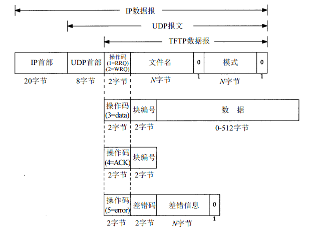

# TFTP

TFTP ： Trivial File Transfer Protocol ( 微型文件传输协议)

这个协议通常是使用在一个无磁盘系统的启动过程中，它和FTP协议比较不同的地方在于，该一般传输一些细小的文件，FTP采用的是TCP来进行传输，而TFTP采用UDP。

**看一下报文结构吧：**

TFTP一共有这么五种报文，主要靠opcode操作码区分：操作码为1的时候为read request读请求，意思时主机向服务器提出读某个文件的请求，后面会跟着文件名，然后以0作为文件名域的结束符；接着是模式，主要有netascii：ascii文本； octet：8比特的数据流。操作码为2时为write request写请求。当操作码为3时指数据操作的报文，其中会标明块的编号，即要读取和写入块的编号，以及数据内容，从这里看的出来，数据最多512字节，和磁盘一个扇区大小一样。操作码为4时是响应报文，告诉对方我知道你要这么操作了。操作码为5意思是服务器告诉客户端你的读写出现了问题。

TFTP使用起来很简单，它是使用UDP进行传输，因此关于包的丢失问题需要由客户端和服务器考虑。那么比如说客户端需要读取服务器的文件，则它先会给服务器发送一个读请求报文，随后等待服务器发送操作码为3携带数据的报文过来，只要收到其中的一块数据就需要回复一个ACK；写请求也类似，客户端先发送一个写请求报文，如果服务器同意写请求则发送一个ACK报文，当客户端收到ACK后发送通过操作码为3的报文发送数据。

TFTP看起来是一个十分简单的文件传输协议，但是这个协议本身不需要验证身份，因此不安全。一般而言支持TFTP的服务器会对读写进行一定的限制防止泄露文件。

