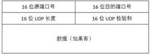
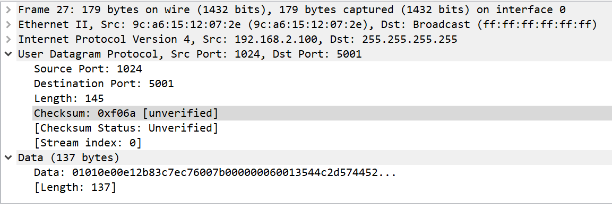

# UDP

udp： 用户数据包协议

简单的一个传输层协议，它是一个面向数据报的协议，也就是它会将需要传输的数据全部写入一个数据包中然后加上协议头部，一起称为IP协议的负载然后发送出去。它也是一个不可靠的协议，你将udp报文发送出去了，到底对方接收到没有是不能保证的。

**报文结构：**

源端口号和目的端口号指示了发送进程和接受进程的端口号，这些端口的最大作用其实是实现了多路复用。udp长度是整个报文的长度，其实很多余，因为整体的长度可以从ip报文中计算中得到（ip总长-ip头部），校验和采用和ip协议同样的方法校验，但是他们本质有些区别。IP协议校验只校验报文头部，而UDP协议会校验头部和数据内容。如果数据部分出现数据不齐的问题，则需要在末尾补0来进行校验。**在计算校验和的时候，UDP还会加入伪头部来进行计算。**对于这个还有一点要讲吧，那么就是udp校验和的检验发生在接受进程和发送进程处，毕竟这个协议是一个端到端的协议。那么如果出现校验和错误呢？报文会被丢弃，但是不会有错误信息会生成，这个错误等待IP层去发现。

上面的图举了个例子，报文的内容其实十分简单。

-----

#### IP分片

为什么要把IP分片放在这边讲，其实确实还是应该放到前面写吧，但是这边的话可以后续**使用一下udp进行一下实验**。

首先为什么要IP分片。IP报文最后是要放入链路层的负载进行传输的，回忆一下链路层会涉及到一个叫做MTU的东西就知道，如果IP报文的总长度超过了MTU，则必须要进行分片才能进行传输。这个分片具体放在主机端还是路由器端其实都可以进行。

那么具体怎么进行分片？在IP协议中我们看到了在报文结构中有这样三个元素：identification，flags，fragment offset。标识identification可以告诉接受方，这是哪一个IP报文的数据，因此对于同一个报文分出的片，identification域互相一致。flags是标志位，要告诉接受方这个报文到底怎么处理了，比如如果将第二位置1了，意味着不需要分片，但是这个会触发一个ICMP错误报文；第三个位置是more fragment域，如果这个位置置1了就告诉主机，这个报文被分片了，这一系列的最后一个报文在这一位上要置0。偏移offset很好理解，要告知主机当前这个分片在原始报文的哪个位置。

当udp报文被分片了，每一个分片就是一个独立的数据报了。那么回想一下IP路由，很有可能出现分片是乱序到达目的地的。当然这种情况使用上述三个元素足以解决问题。但是设想一下这样一种情况：如果其中某个分片丢包了。这种情况下会让发送端重传整个完整报文。为啥不让它只传丢失的那一份？因为有些分片并不一定发生在发送端，而有可能出现在路由器中，回想一下udp报文的性质，发送端不会知道丢失的是哪一部分。

**这里有一个需要强调的点，分片后只有第一个报文是带着传输层头部的，分片中是没有的**

----

## ICMP unreachable error

这里又要插入一个小插曲，如果出现一种特殊情况，如果在flag中将Dont fragment位置为1且报文实际超过了mtu，那么会发送一个ICMP unreachable error的报文

**感兴趣的话可以做一个小实验，如果在arp cache中缺少某个目的地但是要发送一个长报文的话**

