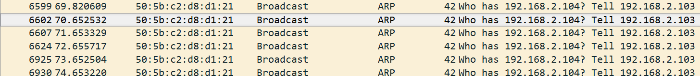
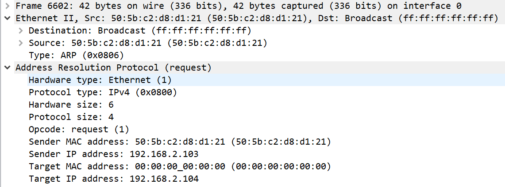

# ARP协议

arp协议： address resoluion protocal 地址解析协议。

作用：在网络层中某个报文要交付到该网络的某个主机上时，需要知道该主机的物理地址。arp协议就是将网路地址转换为物理地址。

过程：默认如果该信息不在arp cache中，则首先向局域网中发送广播包，询问目标主机的物理地址，随后目标主机的arp层响应该报文并且返回自己的ip地址和物理地址。

触发方式很简单，只要在局域网中ping 某一台主机：

报文格式：

简单看一下报文特点，在以太帧中type域值为0x0806代表arp协议，Hardware 和 Protocol指定了需要切换的两种协议的名称。（注意arp不一定一定是ip转换为以太地址）OP很显然是包类型，这里这个是指arp请求。下面四个域很显然了，那么可以注意到的是，arp请求包把mac地址全0了。

在这个过程中，收到arp reply的那一端当然会将目的ip和目的物理地址存入arp cache。这样如果在arp cache中记录就不需要发送request包了，windows命令行中使用arp -a可以查看。（个人猜测arp cache中有一项应该是判断这条信息的state，也就是判断报文是否发送通畅，因为有事请求超时的请求会重发arp请求）

###### 免费arp

这是一种特殊的arp报文，特点是它是一个广播包，并且源IP和目的IP相同，这种报文特点只有两种场合会遇到：

1、一个正在初始化的系统还没有自己的ip地址，需要分配一个新的ip地址；

2、一个主机刚刚更换了它的硬件设备，需要告知网络上的其他主机；

###### arp代理

简单的说，就是当一个主机向一台路由器发起arp请求后，路由器直接将子网中某个主机的物理地址给了这个主机，使得它认为那台路由器就是目标主机了。这当中这台路由器充当了代理的角色。特点是什么呢？如果你在这台主机上使用arp -a命令查看所有的arp信息，你会发现有两条信息的物理地址相同但是ip地址却不同。

###### arp欺骗

**简单案例分析**：这里用一个最简单的案例来说明ARP欺骗的核心步骤。假设在一个LAN里，只有三台主机A、B、C，且C是攻击者。

1. 攻击者聆听局域网上的MAC地址。它只要收到两台主机洪泛的ARP Request，就可以进行欺骗活动。
2. 主机A、B都洪泛了ARP Request.攻击者现在有了两台主机的IP、MAC地址，开始攻击。
3. 攻击者发送一个ARP Reply给主机B，把此包protocol header里的sender IP设为A的IP地址，sender mac设为攻击者自己的MAC地址。
4. 主机B收到ARP Reply后，更新它的ARP表，把主机A的MAC地址（IP_A, MAC_A）改为（IP_A, MAC_C）。
5. 当主机B要发送数据包给主机A时，它根据ARP表来封装数据包的Link报头，把目的MAC地址设为MAC_C，而非MAC_A。
6. 当交换机收到B发送给A的数据包时，根据此包的目的MAC地址（MAC_C）而把数据包转发给攻击者C。
7. 攻击者收到数据包后，可以把它存起来后再发送给A，达到偷听效果。攻击者也可以篡改数据后才发送数据包给A，造成伤害。

# 这里应该做个实验！！