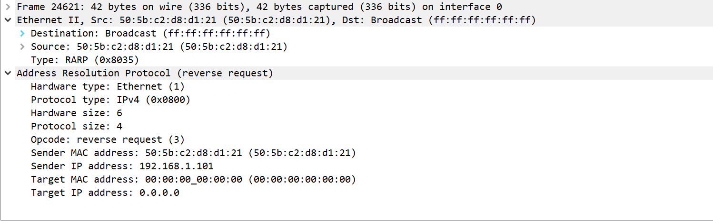

# rarp协议

rarp协议： reverse address resolution protocol 反向地址解析协议

应用场景：这个协议主要针对一些无磁盘的系统。带磁盘的系统一般在初始化的时候可以从磁盘中读出自己的ip地址，但是无磁盘的系统不行，他需要通过一些方法获取ip地址，也就是rarp协议。

过程：这些系统通过将自己的物理地址广播出去。而局域网中需要存在一个rarp server，这个server需要存储一个物理地址和ip地址映射，当server收到rarp广播后，从该报文中读取物理地址然后找到该物理地址对应的ip地址，再以单播的方式返还回去。（如果这个局域网中存在多个server，则每次挑选第一个响应报文。）

报文格式：

这是我用py发包后在wireshark中截取的报文。结构和arp协议的报文一致，唯一的不同在于在链路层的Type域中rarp的类别号是0x8035，而在rarp协议中op域3代表了请求，而4代表了回复。

