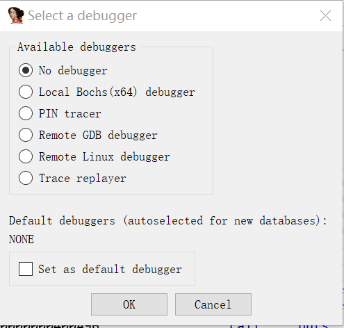
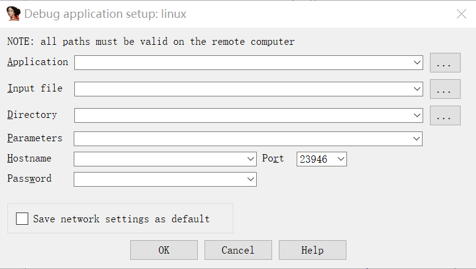

# IDA 中的一些使用

稍微记录一下在做 pwn 的过程中 IDA 的一些使用技巧：

1、如果下载了有 hex-ray 插件的 IDA，则可以在代码段上按下 F5 来显示伪代码，这样就可以不用直接看汇编代码理解程序逻辑了，相对比较快速便捷。

2、在 IDA (IDA view)中是有可能出现数据识别错误的问题的，比如说一个原本是指令的数据最终被识别成了乱码，可以在该数据上右击选择 undefine 退回到原先没有做任何识别的状态，随后右击选择 code 尝试翻译成正确的代码。

3、OllyDB 只能对 PE 文件进行动态调试，而有时 gdb 调试 ELF 会有些限制。使用 IDA 也能对 ELF 动态调试，并且有可视化的界面，功能也十分齐全。

我选择远程调试环境，要搭建这样的环境，首先需要一个 linux 服务器。随后在 IDA 安装目录下找到 dbgsrv 文件夹，有 linux_server 和 linux_server64，分别对应的是调试 32 位程序和 64 位程序。将这两个文件放到服务器上并且修改一下文件属性(chmod 为可执行)。当需要调试一个 ELF 时，先打开服务器上的对应通信程序，随后在 IDA 菜单栏中的 Debugger 挑选远程 linux 调试器。

随后在调试时需要填写如下关键信息：

* Application: 目标程序在服务器上的路径
* Input File：同上
* Directory：目标程序在服务器上的哪个目录下
* Hostname：主机 IP
* Port：一般不用修改，就选择默认

然后开始调试后进入调试界面，使用方法和一般调试器一样都可以打断点然后单步执行。