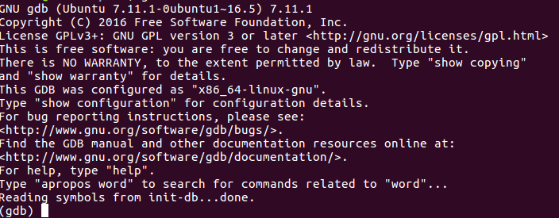
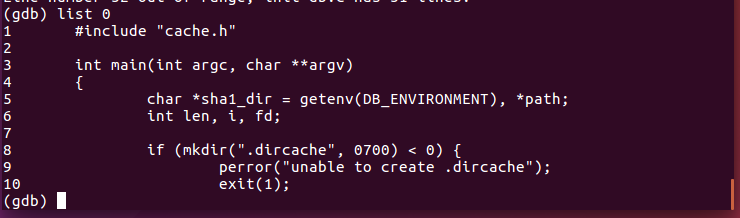

# gdb的使用

先抛出一个前提吧，假设我们编写了一个.c文件叫test.c， 通过gcc的命令 gcc -g test.c -o test 进行编译后，生成了可执行文件。

###### 下面开始进行程序的调试：

###### gdb test

这条命令其实就是进入了调试界面了如果敲了这个命令进入调试界面后的结果如下：

会发现在命令行上方出现了一系列和gdb版本有关的内容，如果不想看到这些内容的话，需要在命令中添加 -q 的选项。

当然也可以选择先gdb -q 进入gdb， 然后输入file test 的方式打开test文件。

###### list 

这条指令可以让你在屏幕上看到源代码，list后面可以跟上许多不同的参数，比如list num 就是可以从第几行开始显示代码，其中默认一次显示10行，如果要继续的话按下enter键即可

当然后面还能跟特定的函数名等等的参数。比如list main。

###### break

设置断点，break linenum, 如果需要查看所有断点的信息则输入命令info breakpoints, 删除断点则用disable命令、clear命令或者delete命令实现

###### run

正式开始调试程序了，程序会停止在你设置的断点处。

如果需要让程序进行下去，可以选择使用continue命令，这样程序会执行到下一个断点处，如果需要一步一步查看程序的执行情况，可以使用step或者next，这两个命令的区别是前者会深入调用函数内部分析，而next则会直接运行函数，不会进入函数体

如果你需要在调试的过程中查看某个变量的值可以使用print指令来打印，如果需要特别设定某个参数的值则使用set指令来设置。

---

## [PEDA](https://github.com/longld/peda)

可能使用普通的 GDB 并不是十分容易进行调试，那么 PEDA 是配合 GDB 而用 python 写的一个简单的插件，这个能够让程序的调试变得轻松和人性化。当我们下载完成后，就可以直接敲 GDB 进行调试了。

这是从官网上拉下来的状态图，可以看到在调试的时候是可以看到当前程序的栈、寄存器和数据区的情况的。这个插件本身内置了许多命令。完整的命令表可以使用 peda help 查询，这里列出部分：

- `aslr` -显示/设置GDB的ASLR设置
- `checksec` -检查二进制文件的各种安全选项
- `dumpargs` -在调用指令处停止时显示传递给函数的参数
- `dumprop` -转储特定内存范围内的所有ROP小工具
- `elfheader` -从调试的ELF文件中获取标头信息
- `elfsymbol` -从ELF文件中获取非调试符号信息
- `lookup` -搜索所有地址/对属于存储范围的地址的引用
- `patch` -修补程序存储器从具有string / hexstring / int的地址开始
- `pattern` -生成，搜索或将循环模式写入内存
- `procinfo` -从/ proc / pid /显示各种信息
- `pshow` -显示各种PEDA选项和其他设置
- `pset` -设置各种PEDA选项和其他设置
- `readelf` -从ELF文件获取标题信息
- `ropgadget` -获取二进制或库的常见ROP小工具
- `ropsearch` -搜索内存中的ROP小工具
- `searchmem|find`-在内存中搜索模式；支持正则表达式搜索
- `shellcode` -生成或下载常见的shellcode。
- `skeleton` -生成python漏洞利用代码模板
- `vmmap` -在调试过程中获取节的虚拟映射地址范围
- `xormem` -用密钥对存储区域进行XOR

那么在真正对程序进行调试的过程中也需要使用许多命令来查询程序状态。

| 命令             | 效果               |
| ---------------- | ------------------ |
| file 路径        | 附加文件           |
| r                | 开始执行           |
| c                | 继续执行           |
| step             | 单步步入           |
| next             | 单步通过           |
| b *地址          | 下断点             |
| enable/disable   | 激活断点/禁用断点  |
| info b           | 查看断点           |
| del num          | 删除断点           |
| find             | 快速查找           |
| x/<n/f/u> <addr> | 查看某个地址的内容 |