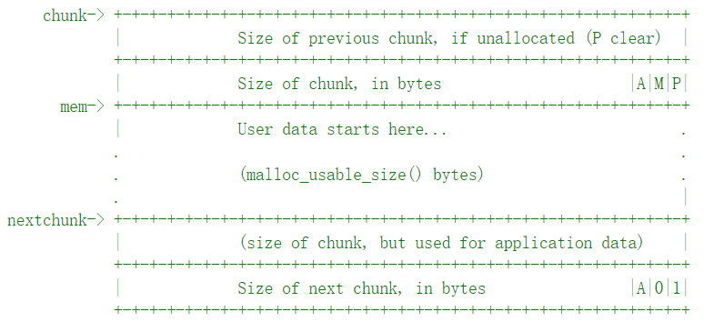
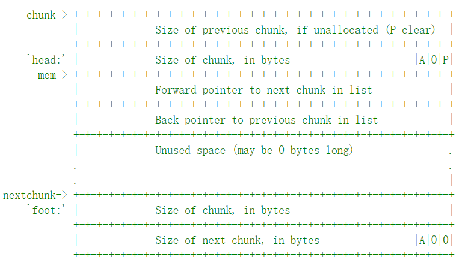

# malloc

为了研究 pwn 中关于堆中的漏洞，先要熟悉一下现在在 libc 中有关堆部分的实现原理。所以这里记录一下在 libc 中 malloc 的实现。看的代码是网上推荐的：https://code.woboq.org/userspace/glibc/malloc/malloc.c.html。版本应该是 2.7.0(glibc 版本应该是 2.29)。

## Comment

看一下前面标注里面对于 malloc 文件中的函数或者数据结构的一些介绍。在标注里面介绍了堆中分配的策略：

> * 对于不小于 512 字节的请求，使用的是一个最佳适配的分配策略，遵循 FIFO
> * 对于不大于 64 字节的请求，会使用一个缓存分配器来分配
> * 如果在其中的请求，系统会尽可能快速分配到空间
> * 如果超过 128 KB 的，则需要依赖系统的内存映射方法

在其中包括了在 C 中常用的函数包括：malloc，calloc，free，realloc，valloc，free 等：

> * malloc(size_t n)：(__libc_malloc(size_t))返回一个新开辟的 chunk，大小至少为 n 字节；如果没有足够的空间就返回 NULL。如果 n 为 0，则返回一个可以分配的最小 chunk(在 32 位系统中是 16 字节，在 64 位系统中是 24 或者 32 字节)。
> * free(void *p)：(__libc_free)释放申请的chunk，如果 p 是空指针是没有影响的。
> * calloc(size_t n_elements, size_t element_size)：(__libc_calloc)返回一个指向 n_elements * element_size 的空间，并且所有空间都置为 0。
> * realloc(void *p, size_t n)：(__libc_realloc)返回一个指向拥有与 p 具有相同数据的，但是大小为 n 的 chunk，返回的指针不一定和 p 相同。

这里就只看上面这些常用的函数的实现，其他还有很多其他函数就暂时先不看。

## chunk

可分配的空间都称为 chunk，在该文件中 chunk 的结构如下：

```c
struct malloc_chunk {
  INTERNAL_SIZE_T      mchunk_prev_size;  /* Size of previous chunk (if free).  */
  INTERNAL_SIZE_T      mchunk_size;       /* Size in bytes, including overhead. */
  struct malloc_chunk* fd;         /* double links -- used only if free. */
  struct malloc_chunk* bk;
  /* Only used for large blocks: pointer to next larger size.  */
  struct malloc_chunk* fd_nextsize; /* double links -- used only if free. */
  struct malloc_chunk* bk_nextsize;
};
```

* mchunk_prev_size：存储了前一块的大小，INTERNAL_SIZE_T 是 size_t 类型，一般而言 32 位系统是 4 字节，64 位系统是 8 字节。
* mchunk_size：这一块的大小
* fd：指向后一个 chunk 的指针
* bk：指向前一个 chunk 的指针
* fd_nextsize：
* bk_nextsize：

在 malloc.c 中有一个很形象的图片：

已分配的 chunk：



未分配的 chunk：



从这两张图上可以看到一些额外的信息，memory 的开始和 chunk 的开始不是一个概念；如果一个块处于已分配的状态，那么下一块的 mchunk_prev_size 可能保存着数据，并且 fd 和 bk 都用来存储数据(未分配的块使用这两个值作为双向链表的连接)。并且在本块的 size 的最后三位是标志位，这是由于 chunk 的大小一定是 8 的倍数。

标志位中最有用的是最后一位 P 标志位，这一位表示前一个 chunk 是否被使用。如果这一位并没有置位则说明上面一块没有被分配，并且 mchunk_prev_size 存放的一定是上一块的大小，因此可以快速找到上一块的位置。

## Data Structure

malloc 中有一个 bin 的概念，bin header 连接了一系列空闲的 chunk，每一个 bin 的存放都是一个双向链表。理论上 bin 链表中的 chunk 是按照大小排序的，但是实际对于小 chunk 由于在 bin 中大小大家都一样，所以小 chunk 无需排序，但是对于大 chunk 实施最适配分配策略，所以需要排序来提高效率。

如果单个 bin 的大小小于 512 字节(小 chunk)，每个双向链表中的 chunk 是相同大小的，可以看到大致是这么分的：

> 64 bins of size       8
> 32 bins of size      64
> 16 bins of size     512
> 8 bins of size    4096
> 4 bins of size   32768
> 2 bins of size  262144
> 1 bin  of size what's left

那么早这里面有一个很经典的操作，就是从这个空闲链表上取下一个 chunk，这个在堆里有一个额外的名字叫做 unlink，这个操作很重要，因为有很多漏洞就和 unlink 有关。

```c
unlink_chunk (mstate av, mchunkptr p)
{
  if (chunksize (p) != prev_size (next_chunk (p)))
    malloc_printerr ("corrupted size vs. prev_size");
  mchunkptr fd = p->fd;
  mchunkptr bk = p->bk;
  if (__builtin_expect (fd->bk != p || bk->fd != p, 0))
    malloc_printerr ("corrupted double-linked list");
  fd->bk = bk;
  bk->fd = fd;
    
  if (!in_smallbin_range (chunksize_nomask (p)) && p->fd_nextsize != NULL)
    {
      if (p->fd_nextsize->bk_nextsize != p
          || p->bk_nextsize->fd_nextsize != p)
        malloc_printerr ("corrupted double-linked list (not small)");
      if (fd->fd_nextsize == NULL)
        {
          if (p->fd_nextsize == p)
            fd->fd_nextsize = fd->bk_nextsize = fd;
          else
            {
              fd->fd_nextsize = p->fd_nextsize;
              fd->bk_nextsize = p->bk_nextsize;
              p->fd_nextsize->bk_nextsize = fd;
              p->bk_nextsize->fd_nextsize = fd;
            }
        }
      else
        {
          p->fd_nextsize->bk_nextsize = p->bk_nextsize;
          p->bk_nextsize->fd_nextsize = p->fd_nextsize;
        }
    }
}c
```

对于小的 bin 而言，浓缩一下代码起始就是：

```c
if (chunksize (p) != prev_size (next_chunk (p)))
    malloc_printerr ("corrupted size vs. prev_size");
  mchunkptr fd = p->fd;
  mchunkptr bk = p->bk;
  if (__builtin_expect (fd->bk != p || bk->fd != p, 0))
    malloc_printerr ("corrupted double-linked list");c
  fd->bk = bk;
  bk->fd = fd;
```

在数据结构内容中，还有一些比较特殊的 bin，和这个普通的空闲链表不同：

### unsorted bin

这个队列存在的价值在于，有一些由于 chunk split(块分割) 或者是那些应该是退还回来的 chunk，都会先存放在这里，相当于先缓存一次，如果下一次 malloc 并没有用到它们，那么它们就会回到普通的 bin 链表中。

### Top

这是相当于最后能用到的一块 chunk，在这里是做了特殊处理的，它不会处于任何的 bin 中，并且只会在没有其他任何 chunk 可用的情况下才会被使用。

### Fastbins

起始是一个数组存放多个 Fastbin，多个链表存放了最近才被释放的小 chunk，并且 Fastbin 链表并不是双向链表，并且 chunk 的 P 位不会被抹去，所以它们不会与其他块合并。

在网上查找的资料都显示 Fastbin 的一些信息，Fastbin 一共只有 10 个，并且最小的一个 bin 是 16 个字节，每个bin 逐级提高 8 个字节，所以一共是 16 - 80 个字节。我估计是通过 NFASTBIN 和块大小加上索引的计算方法推断出来的结果。这些性质先记录一下。

## state

这是一个总的堆分配情况的状态结构：

```c
struct malloc_state
{
  /* Serialize access.  */
  __libc_lock_define (, mutex);
  /* Flags (formerly in max_fast).  */
  int flags;
  /* Set if the fastbin chunks contain recently inserted free blocks.  */
  /* Note this is a bool but not all targets support atomics on booleans.  */
  int have_fastchunks;
  /* Fastbins */
  mfastbinptr fastbinsY[NFASTBINS];
  /* Base of the topmost chunk -- not otherwise kept in a bin */
  mchunkptr top;
  /* The remainder from the most recent split of a small request */
  mchunkptr last_remainder;
  /* Normal bins packed as described above */
  mchunkptr bins[NBINS * 2 - 2];
  /* Bitmap of bins */
  unsigned int binmap[BINMAPSIZE];
  /* Linked list */
  struct malloc_state *next;
  /* Linked list for free arenas.  Access to this field is serialized
     by free_list_lock in arena.c.  */
  struct malloc_state *next_free;
  /* Number of threads attached to this arena.  0 if the arena is on
     the free list.  Access to this field is serialized by
     free_list_lock in arena.c.  */
  INTERNAL_SIZE_T attached_threads;
  /* Memory allocated from the system in this arena.  */
  INTERNAL_SIZE_T system_mem;
  INTERNAL_SIZE_T max_system_mem;
};
```

---

上面是碰到的一些比较重要的结构，具体操作下面来看。

**malloc**

我们所调用的 malloc 实际是 \_\_libc\_malloc 的别名，而仔细查看 \_\_libc\_malloc 的代码，会发现真正在做分配的底层函数是 \_\_int\_malloc。舍弃一些和线程有关的结构，直接看一下为当前线程分配空间时的步骤：

最先碰到的函数是  checked_request2size， 要对输入的字节数进行处理，转换为所需要的 chunk 的大小。

```c
#define checked_request2size(req, sz) 
({                                    
  (sz) = request2size (req);            
  if (((sz) < (req))       // 这里的目的是为了防止整数运算的溢出             
      || REQUEST_OUT_OF_RANGE (sz)) 
    {                                    
      __set_errno (ENOMEM);            
      return 0;                            
    }                                    
})


#define request2size(req)    
	// 找到合适的 chunk 大小，如果申请的小就按照最小的 chunk 大小，否则可以看到会找一个满足对齐的最小的满足条件的 chunk 大小
  (((req) + SIZE_SZ + MALLOC_ALIGN_MASK < MINSIZE)  ?           
   MINSIZE :                                                    
   ((req) + SIZE_SZ + MALLOC_ALIGN_MASK) & ~MALLOC_ALIGN_MASK)
```

1. 如果申请的大小适合 fastbin 的大小，优先在其中查找：

   ```c
   if ((unsigned long) (nb) <= (unsigned long) (get_max_fast ())) //如果符合 fastbin 的大小
       {
         idx = fastbin_index (nb); //找到是哪一条 fastbin 链表
         mfastbinptr *fb = &fastbin (av, idx); // 根据 idx 获取了当前的 fastbin 链表
         mchunkptr pp;
         victim = *fb;
         if (victim != NULL)
           {
             if (SINGLE_THREAD_P)
               *fb = victim->fd; // fastbin 是 LIFO，这里直接拿链表头部的
             else
               REMOVE_FB (fb, pp, victim);
             if (__glibc_likely (victim != NULL))
               {
                 size_t victim_idx = fastbin_index (chunksize (victim));
                 if (__builtin_expect (victim_idx != idx, 0))
                   malloc_printerr ("malloc(): memory corruption (fast)");
                 check_remalloced_chunk (av, victim, nb); // 这里应该没啥用
   #if USE_TCACHE
                 /* While we're here, if we see other chunks of the same size,
                    stash them in the tcache.  */
                 size_t tc_idx = csize2tidx (nb);
                 if (tcache && tc_idx < mp_.tcache_bins)
                   {
                     mchunkptr tc_victim;
                     /* While bin not empty and tcache not full, copy chunks.  */
                     while (tcache->counts[tc_idx] < mp_.tcache_count
                            && (tc_victim = *fb) != NULL)
                       {
                         if (SINGLE_THREAD_P)
                           *fb = tc_victim->fd;
                         else
                           {
                             REMOVE_FB (fb, pp, tc_victim);
                             if (__glibc_unlikely (tc_victim == NULL))
                               break;
                           }
                         tcache_put (tc_victim, tc_idx);
                       }
                   }
   #endif
                 void *p = chunk2mem (victim); // 返回的是地址，应该时返回真实能够存储数据的地方
                 alloc_perturb (p, bytes); // 清空这篇空间
                 return p;
               }
           }
       }
   ```

2. 如果 Fastbin 中没有合适的项，就去 smallbin 里查看：

   ```c
   if (in_smallbin_range (nb))
       {
         idx = smallbin_index (nb);  // 计算要拿的 smallbin 的系数
         bin = bin_at (av, idx); // 定位到该 smallbin 的链表
         if ((victim = last (bin)) != bin) // 从该链的最后一个 chunk 开始
           {
             bck = victim->bk; // 下面的三步就是将 smallbin 上的一个 chunk 取下来
             if (__glibc_unlikely (bck->fd != victim))
               malloc_printerr ("malloc(): smallbin double linked list corrupted");
             set_inuse_bit_at_offset (victim, nb);
             bin->bk = bck;
             bck->fd = bin;
             if (av != &main_arena)
               set_non_main_arena (victim);
             check_malloced_chunk (av, victim, nb);
   #if USE_TCACHE
             /* While we're here, if we see other chunks of the same size,
                stash them in the tcache.  */
             size_t tc_idx = csize2tidx (nb);
             if (tcache && tc_idx < mp_.tcache_bins)
               {
                 mchunkptr tc_victim;
                 /* While bin not empty and tcache not full, copy chunks over.  */
                 while (tcache->counts[tc_idx] < mp_.tcache_count
                        && (tc_victim = last (bin)) != bin)
                   {
                     if (tc_victim != 0)
                       {
                         bck = tc_victim->bk;
                         set_inuse_bit_at_offset (tc_victim, nb);
                         if (av != &main_arena)
                           set_non_main_arena (tc_victim);
                         bin->bk = bck;
                         bck->fd = bin;
                         tcache_put (tc_victim, tc_idx);
                       }
                   }
               }
   #endif
             void *p = chunk2mem (victim);
             alloc_perturb (p, bytes);
             return p;
           }
       }
   ```

3. 如果是大的请求，则需要预先进行一次 consolidate 空间：

   ```c
    else
       {
         idx = largebin_index (nb);
         if (atomic_load_relaxed (&av->have_fastchunks))
           malloc_consolidate (av);
       }
   ```

   

4. 

---

## arean 和 main_arean